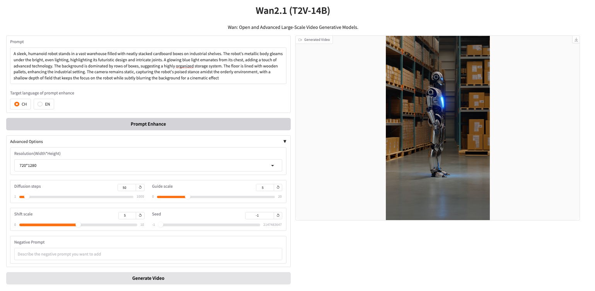

(**Note**: this is the first of several upcoming personal experiments with various LLMs for Generative AI on the clouds - stay tuned !)

<p align="center">
    
<p>

## Sections

* [Wan AI models](#wan-ai-models)
* [Execution tests](#execution-tests)
* [Key aspects of Docker file](#key-aspects-of-docker-file)
* [Execution on AWS ECS cluster](#execution-on-aws-ecs-cluster)

## Wan AI models
Wan AI, the entity responsible for Alibaba Cloud's large-scale generative models, has [just released](https://www.reuters.com/technology/artificial-intelligence/alibaba-release-open-source-version-video-generating-ai-model-2025-02-25/) 
Wan 2.1, a “*comprehensive and open suite of video foundation models that pushes the boundaries of video generation*”. 

Alibaba has released four variants of Wan 2.1 - T2V-1.3B, T2V-14B, I2V-14B-720P and I2V-14B-480P - 
which generate images and videos from text and image input. This article will focus on the small 
(1.3 billion parameters) model with text-to-video capabilities: Wan2.1-T2V-1.3B.

See their [web site](https://wanxai.com/) for all details about the project. 

The Github repo is at [https://github.com/Wan-Video/Wan2.1](https://github.com/Wan-Video/Wan2.1)

## Execution tests

Our goal is to evaluate those Wan models in a fully isolated and portable environment. 
The Wan 2.1 project does not supply yet a Docker file to build and execute the project. 
So, we developed one (documented here below) that can be used for running the video generation on your GPU-equipped 
laptop or in a cloud-based container service. It will be AWS Elastic Container Service (ECS) in our case because it 
gives easy access to multiple types of GPU via ad hoc EC2 instance types on AWS.

To have a comparison basis for the output, we used the prompt published by Nvidia in their 
[Cosmos project](https://github.com/NVIDIA/Cosmos), launched in January 2025, to see the interpretation 
of same words by different models. 

It is (see Cosmos’ Github repo for prompt and resulting video):  "*A sleek, humanoid robot stands in a vast warehouse 
filled with neatly stacked cardboard boxes on industrial shelves. The robot's metallic body gleams under the bright, 
even lighting, highlighting its futuristic design and intricate joints. A glowing blue light emanates from its chest, 
adding a touch of advanced technology. The background is dominated by rows of boxes, suggesting a highly organized 
storage system. The floor is lined with wooden pallets, enhancing the industrial setting. The camera remains static, 
capturing the robot's poised stance amidst the orderly environment, with a shallow depth of field that keeps the focus 
on the robot while subtly blurring the background for a cinematic effect*."

The Wan project has added a nice interactive interface, based on [HuggingFace’s Gradio](https://www.gradio.app/), to more 
easily enter the prompts. 

)

The video generated with 50 diffusion steps (whose processing lasts approximately 44.5 minutes for a video duration of 5s) 
from this prompt has been uploaded on Youtube, you can watch it by clicking on image below.

[](https://www.youtube.com/watch?v=5xnT9OjfhEY)

For this test, Wan2.1-T2V-1.3B has been deployed in a ECS cluster on an EC2 instance of type 
[g6.12xlarge](https://aws.amazon.com/ec2/instance-types/g6/) EC2, 
featuring 4 x [NVIDIA L4 Tensor Core](https://www.nvidia.com/en-us/data-center/l4/) GPUs with 24GB of RAM 
per GPU. 

## Key aspects of Docker file

This section describes the main aspects of this Dockerfile (available here) in case you need to customize it for reuse in your environment:
*	It is based on the image pytorch/pytorch:2.6.0-cuda12.6-cudnn9-devel (sourced directly from Docker hub - size: 13GB+ when stored 
in Docker registry), which brings Pytorch, Nvidia’s CUDA and all their dependencies on top of Python 3.11 and Ubuntu 22.04 (Jammy Jellyfish)
*	The Linux environment variable LD_LIBRARY_PATH has to be extended to allow dynamic loading of Mesa libraries as Pytorch needs 
them in its execution
*  The Linux environment variable PYTORCH_CUDA_ALLOC_CONF is set to `expandable_segments:True` to optimize GPU memory and avoid 
some  errors of type `torch.OutOfMemoryError: CUDA out of memory`
*	The model will look for the model weights in container directory /home/model/Wan-AI/<name of the model>. For this test, the model 
is Wan2.1-T2V-1.3B, whose size is approx 14GB when loaded onto the GPU (see output of `nvidia-smi` command below). This respectable size limits the model of GPU that can be used 
for video generation: the  GPU board memory must accept the load of those weights plus those of associated computation binaries. 
* The Wan model is NOT included in the image to keep it generic and not too big. It is supposed to be accessible via a volume mounted when `docker run command` is executed. 
So, import its files on the host system before starting the container and [mount the corresponding directory](https://docs.docker.com/engine/storage/volumes/#syntax). 
On ECS, we run a command copying the model from S3 (to avoid fetching from HuggingFace on each start) to the EC2 instance providing 
the compute capacity, when this instance starts.
*  Several environment variables are defined to provide additional flexibility (`$MODEL,$MODEL_DIR,$LAUNCHER`) to be able to use 1 single image 
and dynamically change its configuration.
*  The exposed port 7860 is the standard one used by Gradio.

If you are not interested in building the model by yourself, we provide a pre-built 
image at https://hub.docker.com/repository/docker/didierdurand/lic-wan-ai/general on Docker Hub. You can also easily build 
your own customized image by forking this repo and adapt the Dockerfile to your needs and build it via the provided yaml 
script building the image and pushing it to Docker Hub. This script based on standard [GitHub Actions](https://docs.github.com/en/actions).

The Docker file is located at `docker/Dockerfile-wanv2_1`. All suggestions to improve it are welcome: 
[open a ticket](https://github.com/didier-durand/llms-in-clouds/issues) for yours

For readability purposes, the Docker file copied here:

```
FROM pytorch/pytorch:2.6.0-cuda12.6-cudnn9-devel

# install tools + libglib2.0-0 & libx11-6 because Gradio needs them on Linux and they are missing in base Nvidia image
# hadolint ignore=DL3008
RUN apt-get update  \
    && apt-get upgrade -y \
    && apt-get install -y --no-install-recommends curl wget git libglib2.0-0 libx11-6 libxrender1 libxtst6 libxi6 \
    && apt-get clean \
    && rm -rf /var/lib/apt/lists/*

# check & upgrade pip
RUN python --version \
    && python -m ensurepip --upgrade \
    && python -m pip install --upgrade pip

# clone project
WORKDIR "/home"
RUN git clone "https://github.com/Wan-Video/Wan2.1.git"
ARG WAN_DIR="/home/Wan2.1"
WORKDIR ${WAN_DIR}

# install project requirements + xfuser for multi-GPU support
RUN python -m pip install --upgrade -r requirements.txt \
    && python -m pip install --upgrade "xfuser==0.4.1"

# ? used to have a regex which avoids COPY failure in absence of patch file
ARG PATCH_SHELL="patch-wan-ai-2.1.sh"
COPY "patch/${PATCH_SHELL}"? "${WAN_DIR}/"
# hadolint ignore=SC2015
RUN  test -f  ${PATCH_SHELL} && bash ${PATCH_SHELL} || true

ARG MODEL_DIR="/home/model"
# model dir must be created at image build time to allow volume bind on container start
WORKDIR ${MODEL_DIR}

#back to Wan dir as initial working dir for execution
WORKDIR ${WAN_DIR}

# communication parameters
ENV HOST="0.0.0.0"
ENV PORT=7860

# MODEL, LAUNCHER & CKPT_DIR can be ovveriden by in docker run with -e / --env option
ENV WAN_DIR=${WAN_DIR}
ENV MODEL="Wan-AI/Wan2.1-T2V-1.3B"
ENV MODEL_DIR=${MODEL_DIR}
ENV LAUNCHER="t2v_14B_singleGPU.py"
ENV CKPT_DIR=${MODEL_DIR}/${MODEL}

EXPOSE ${PORT}

# Wan model needs access to some Mesa libraries, which are not initially included in LD_LIBRARY_PATH
ENV LD_LIBRARY_PATH=$LD_LIBRARY_PATH:/opt/nvidia/nsight-compute/2024.3.2/host/linux-desktop-glibc_2_11_3-x64/Mesa
# to try to avoid CUDA out-of-memory errors
ENV PYTORCH_CUDA_ALLOC_CONF=expandable_segments:True

CMD ["bash", "-c", "printenv && cd gradio && python ${LAUNCHER} --ckpt_dir ${CKPT_DIR} || sleep infinity"]
```


## Execution on AWS ECS cluster

When started as an ECS Task in a ECS service, the logs emitted by Wan2.1-T2V-1.3B are the following. 
When prompt with the prompt described above, the model will do 50 iterations each lasting each approx 53.5s. 
So the total computing duration is 44min34s as per last line of logs

```
==========
== CUDA ==
==========

CUDA Version 12.6.3

Container image Copyright (c) 2016-2023, NVIDIA CORPORATION & AFFILIATES. All rights reserved.

This container image and its contents are governed by the NVIDIA Deep Learning Container License.
By pulling and using the container, you accept the terms and conditions of this license:
https://developer.nvidia.com/ngc/nvidia-deep-learning-container-license

A copy of this license is made available in this container at /NGC-DL-CONTAINER-LICENSE for your convenience.

NV_LIBCUBLAS_VERSION=12.6.4.1-1
NVIDIA_VISIBLE_DEVICES=GPU-3e87a3ac-7976-fd2e-a07d-46800f815303,GPU-5360b4b6-3676-6faf-c8ce-e0e112d637e2,GPU-9c86b415-618d-d34d-3e8a-67bafa3d517c,GPU-95cb2c24-7310-9081-cfdb-c8f9b24dc896
NV_NVML_DEV_VERSION=12.6.77-1
AWS_EXECUTION_ENV=AWS_ECS_EC2
NV_LIBNCCL_DEV_PACKAGE=libnccl-dev=2.23.4-1+cuda12.6
NV_LIBNCCL_DEV_PACKAGE_VERSION=2.23.4-1
AWS_CONTAINER_CREDENTIALS_RELATIVE_URI=/v2/credentials/fbf4969c-9cbe-470b-9833-0ea1e699a871
HOSTNAME=ip-10-0-1-219.us-west-2.compute.internal
NVIDIA_REQUIRE_CUDA=cuda>=12.6 brand=unknown,driver>=470,driver<471 brand=grid,driver>=470,driver<471 brand=tesla,driver>=470,driver<471 brand=nvidia,driver>=470,driver<471 brand=quadro,driver>=470,driver<471 brand=quadrortx,driver>=470,driver<471 brand=nvidiartx,driver>=470,driver<471 brand=vapps,driver>=470,driver<471 brand=vpc,driver>=470,driver<471 brand=vcs,driver>=470,driver<471 brand=vws,driver>=470,driver<471 brand=cloudgaming,driver>=470,driver<471 brand=unknown,driver>=535,driver<536 brand=grid,driver>=535,driver<536 brand=tesla,driver>=535,driver<536 brand=nvidia,driver>=535,driver<536 brand=quadro,driver>=535,driver<536 brand=quadrortx,driver>=535,driver<536 brand=nvidiartx,driver>=535,driver<536 brand=vapps,driver>=535,driver<536 brand=vpc,driver>=535,driver<536 brand=vcs,driver>=535,driver<536 brand=vws,driver>=535,driver<536 brand=cloudgaming,driver>=535,driver<536 brand=unknown,driver>=550,driver<551 brand=grid,driver>=550,driver<551 brand=tesla,driver>=550,driver<551 brand=nvidia,driver>=550,driver<551 brand=quadro,driver>=550,driver<551 brand=quadrortx,driver>=550,driver<551 brand=nvidiartx,driver>=550,driver<551 brand=vapps,driver>=550,driver<551 brand=vpc,driver>=550,driver<551 brand=vcs,driver>=550,driver<551 brand=vws,driver>=550,driver<551 brand=cloudgaming,driver>=550,driver<551
NV_LIBCUBLAS_DEV_PACKAGE=libcublas-dev-12-6=12.6.4.1-1
NV_NVTX_VERSION=12.6.77-1
NV_CUDA_CUDART_DEV_VERSION=12.6.77-1
NV_LIBCUSPARSE_VERSION=12.5.4.2-1
NV_LIBNPP_VERSION=12.3.1.54-1
NCCL_VERSION=2.23.4-1
PWD=/home/Wan2.1
ECS_CONTAINER_METADATA_URI_V4=http://169.254.170.2/v4/bee302b2-a59b-4ace-b269-058efbfaf7ba
PORT=7860
NVIDIA_DRIVER_CAPABILITIES=compute,utility
NV_NVPROF_DEV_PACKAGE=cuda-nvprof-12-6=12.6.80-1
NV_LIBNPP_PACKAGE=libnpp-12-6=12.3.1.54-1
NV_LIBNCCL_DEV_PACKAGE_NAME=libnccl-dev
NV_LIBCUBLAS_DEV_VERSION=12.6.4.1-1
WAN_DIR=/home/Wan2.1
NVIDIA_PRODUCT_NAME=CUDA
NV_LIBCUBLAS_DEV_PACKAGE_NAME=libcublas-dev-12-6
NV_CUDA_CUDART_VERSION=12.6.77-1
HOME=/root
MODEL=Wan-AI/Wan2.1-T2V-1.3B
CUDA_VERSION=12.6.3
NV_LIBCUBLAS_PACKAGE=libcublas-12-6=12.6.4.1-1
PYTORCH_VERSION=2.6.0
NV_CUDA_NSIGHT_COMPUTE_DEV_PACKAGE=cuda-nsight-compute-12-6=12.6.3-1
CKPT_DIR=/home/model/Wan-AI/Wan2.1-T2V-1.3B
NV_LIBNPP_DEV_PACKAGE=libnpp-dev-12-6=12.3.1.54-1
NV_LIBCUBLAS_PACKAGE_NAME=libcublas-12-6
NV_LIBNPP_DEV_VERSION=12.3.1.54-1
ECS_AGENT_URI=http://169.254.170.2/api/bee302b2-a59b-4ace-b269-058efbfaf7ba
NV_LIBCUSPARSE_DEV_VERSION=12.5.4.2-1
HOST=0.0.0.0
LIBRARY_PATH=/usr/local/cuda/lib64/stubs
ECS_CONTAINER_METADATA_URI=http://169.254.170.2/v3/bee302b2-a59b-4ace-b269-058efbfaf7ba
SHLVL=1
NV_CUDA_LIB_VERSION=12.6.3-1
NVARCH=x86_64
LAUNCHER=t2v_14B_singleGPU.py
NV_LIBNCCL_PACKAGE=libnccl2=2.23.4-1+cuda12.6
LD_LIBRARY_PATH=/usr/local/nvidia/lib:/usr/local/nvidia/lib64:/opt/nvidia/nsight-compute/2024.3.2/host/linux-desktop-glibc_2_11_3-x64/Mesa
NV_CUDA_NSIGHT_COMPUTE_VERSION=12.6.3-1
NUM_GPUS=1
NV_NVPROF_VERSION=12.6.80-1
PATH=/usr/local/nvidia/bin:/usr/local/cuda/bin:/opt/conda/bin:/usr/local/nvidia/bin:/usr/local/cuda/bin:/usr/local/sbin:/usr/local/bin:/usr/sbin:/usr/bin:/sbin:/bin
NV_LIBNCCL_PACKAGE_NAME=libnccl2
NV_LIBNCCL_PACKAGE_VERSION=2.23.4-1
MODEL_DIR=/home/model
_=/usr/bin/printenv
Downloading shards: 100%|██████████| 8/8 [07:25<00:00, 55.72s/it]
Loading checkpoint shards: 100%|██████████| 8/8 [00:01<00:00,  7.11it/s]
Step1: Init prompt_expander...done
Step2: Init 14B t2v model...done
* Running on local URL:  http://0.0.0.0:7860

To create a public link, set `share=True` in `launch()`.
100%|██████████| 50/50 [44:34<00:00, 53.48s/it]

```

As expected, only 1 GPU out of the 4 available ones is used by the 1.3B mono-GPU model.
```
$ nvidia-smi
  +-----------------------------------------------------------------------------------------+
| NVIDIA-SMI 550.144.03             Driver Version: 550.144.03     CUDA Version: 12.4     |
|-----------------------------------------+------------------------+----------------------+
| GPU  Name                 Persistence-M | Bus-Id          Disp.A | Volatile Uncorr. ECC |
| Fan  Temp   Perf          Pwr:Usage/Cap |           Memory-Usage | GPU-Util  Compute M. |
|                                         |                        |               MIG M. |
|=========================================+========================+======================|
|   0  NVIDIA L4                      On  |   00000000:38:00.0 Off |                    0 |
| N/A   70C    P0             71W /   72W |   14645MiB /  23034MiB |    100%      Default |
|                                         |                        |                  N/A |
+-----------------------------------------+------------------------+----------------------+
|   1  NVIDIA L4                      On  |   00000000:3A:00.0 Off |                    0 |
| N/A   26C    P8             16W /   72W |       4MiB /  23034MiB |      0%      Default |
|                                         |                        |                  N/A |
+-----------------------------------------+------------------------+----------------------+
|   2  NVIDIA L4                      On  |   00000000:3C:00.0 Off |                    0 |
| N/A   29C    P8             16W /   72W |       4MiB /  23034MiB |      0%      Default |
|                                         |                        |                  N/A |
+-----------------------------------------+------------------------+----------------------+
|   3  NVIDIA L4                      On  |   00000000:3E:00.0 Off |                    0 |
| N/A   28C    P8             16W /   72W |       4MiB /  23034MiB |      0%      Default |
|                                         |                        |                  N/A |
+-----------------------------------------+------------------------+----------------------+
                                                                                         
+-----------------------------------------------------------------------------------------+
| Processes:                                                                              |
|  GPU   GI   CI        PID   Type   Process name                              GPU Memory |
|        ID   ID                                                               Usage      |
|=========================================================================================|
|    0   N/A  N/A      7653      C   python                                      14636MiB |
+-----------------------------------------------------------------------------------------+

```

 


