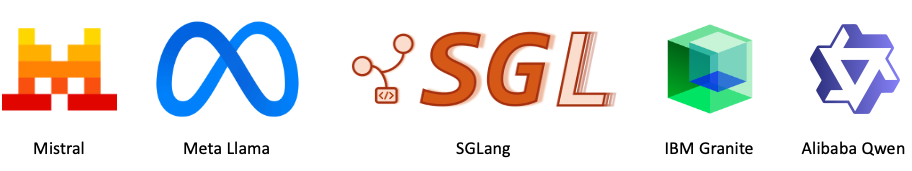

    

# LLMs in Clouds: experiments and tools for Large Language Models in clouds

### Preamble

This repository aggregates several experiments that I run to better use OSS LLMs: Mistral, Meta's Llama, IBM's Granite, Alibaba's Qwen 
& WAN AI, etc. I also share some tools and utilities that I developed to raise my efficiency and productivity in those experiments. So, feel free 
to come back on a regular basis to discover my latest productions.

All this content is shared under MIT License (see [its benefits](https://itexus.com/understanding-the-mit-license-a-simple-guide-for-developers-and-businesses/)) 
to make code and content reusable in your own context with no hassle. So, don't hesitate to integrate what you need from 
this repository in your own context. My humble demand: please, mention this repository as origin whenever you use some of 
its content. Thank you!

### Experiments and tools

1. **[OpenManus & SmolLM as autonomous AI agent](docs/openmanus-smollm.md)** (March 2025): experiment and Docker image (get it with `docker pull didierdurand/openmanus-smollm:latest`) 
to create an autonomous AI agent by integrating OpenManus and HuggingFace's SmolLM (served by Ollama) in a single Docker image for exploration of agentic workflows. 
2. **[SGLang on ECS: efficiently serving leading OSS LLMs](docs/sglang.md)** (March 2025): experiment and Docker image (get it with `docker pull didierdurand/lic-sglang:al2023-latest`) 
to load and execute various leading LLMs on an AWS cluster with Elastic Container Service (ECS). Specific preliminary tests 
with Qwen QwQ-32B to explore its reasoning capabilities.
3. **[Wan AI v2.1 video generation](docs/wan2-1.md)** (March 2025): experiment and Docker image (get it with `ddocker pull didierdurand/lic-wan-ai:latest`) 
to generate videos with Alibaba's Wan AI v2.1 models on an AWS cluster with Elastic Container Service (ECS).
4. **[HuggingFace to S3 Download](/docs/hf-download.md)** (February 2025): a simple AWS CloudFormation template to instantiate in your AWS account in order to efficiently 
download families of LLMs from HuggingFace to AWS S3 bucket storage without ever transiting via your laptop or server.

