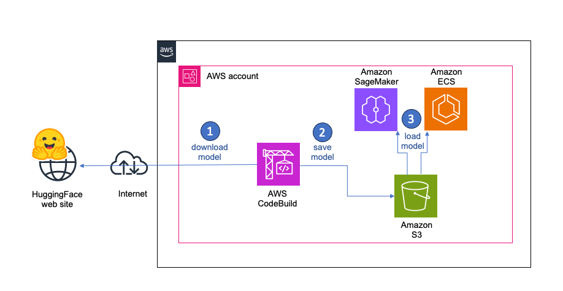

## Efficiently download and store multiple large models (LLMs) from HuggingFace to S3

[](https://github.com/didier-durand/llms-in-clouds/actions/workflows/lint_cfn.yaml)

### Sections

* [Rationale](#rationale)
* [Usage](#usage)
* [Execution in AWS CodeBuild](#execution-in-aws-codebuild)

### Rationale

Providers of LLM models tend to release them in families of multiple members. Quite often, you need to compare several 
of those members to select the right one with the right compromise between latency and quality for the responses. 
Additionally, those models tend to be large: 50GB+ is not at all uncommon for high-end models. So, you cannot download them 
on-the-fly each time from HuggingFace (HF) for obvious reasons (cost, latency, security, etc.). 
This simple CloudFormation (CFN) template allows to create a mechanism running on AWS cloud to download LLM models from 
HuggingFace (HF) site and store them in S3 for re-use.  The created CFN stack mainly consists of an AWS CodeBuild project 
that can be triggered from the AWS console whenever a new model needs to be downloaded. 



The goal is to allow fast(er), efficient, scalable and safe archiving and retrieval of large models when they are deployed 
on AWS Cloud: they never transit via a personal laptop or any other machine with reduced bandwidth. Similarly, 
for inferences and other ML activities, those models are retrieved directly from S3 instead of HF. 

Those stored models can also be used for multiple activities: of course productive inferences but distillation, 
quantization, fine-tuning, etc. on AWS service like Elastic Cluster Service (ECS) or SageMaker.

To make the life of users easy, .i.e. to avoid changes / update to the CFN stack after it is instantiated (for example, 
when a new list of models has to be downloaded) and to avoid the necessity of granting CFN privileges to the users, 
we define the target bucket, target path and LLM model list as AWS Systems Manager (SSM) parameters that can be easily 
updated via the AWS console by SSM-authorized users with no need for them to have credentials on the CFN stack or on 
the CodeBuild project (except right to launch it)

We also support the HuggingFace access token, as an optional SSM Parameter. It may be required to authenticate to WF 
when the license of a given model requires some pre-download agreement on the HuggingFace web site.

*Note*: if you wonder what the UnicitySuffix parameter is used for. It extracts a chunk of the unique CFN stack UUID. 
This chunk is then appended to all resource names to avoid issues of name duplicates when multiple instances of this stack 
template are instantiated simultaneously.

## Usage

1.	If needed before its instantiation, update the stack template with the default values for the parameters named LlmModels, 
PathToModels, BucketName with your own values. The list of models is a comma-separated string. Note: do not update the HF 
token in the CFN template, you’ll update the corresponding AWS SSM parameter after the CFN created it.
2.	Instantiate the CloudFormation stack via AWS Console, AWS CLI or any SDK. In standard situation, you’ll never have to 
update it again: everything happens via change of values for the parameters.
3.	If needed update the various parameters (s3 bucket, model list and path, access token) in SSM Parameter Store via 
the AWS Console interactive UI.
4.	Start the build project via the AWS CodeBuild console to download the models to your S3 bucket. The HF CLI will handle 
the download and save it.

*Notes:* 

1. the IAM CodeBuild execution role limits the authorization of the Codebuild project. It can only execute CloudWatch logs, SSM and S3 commands 
to log activity, access SSM parameters and save models in the S3 bucket. We defined actions as 's3:\*' on resource '\*'. If your environment requires it, you can 
further tighten credentials by restricting the resources to the specific log streams, parameters and bucket in use.
2. On the cost efficiency side, CodeBuild pricing is charged with the [pay-as-you-go model](https://aws.amazon.com/codebuild/pricing/): **There are no upfront costs or minimum fees. You pay 
only for the resources you use. You are charged for compute resources based on the duration it takes your build to 
run. The rate depends on the selected compute type.** So, the CodeBuild project in the CFN template won't cost you if you don't use it. Same 
thing for standard SSM parameters and IAM roles. For all those services, only API calls (from console or CLI) will be charged.
3. The GitHub workflow [lint_cfn.yaml](../.github/workflows/lint_cfn.yaml) attached to this repository checks the quality 
of the CFN template each time we commit a new version. It raises an error as soon as cfn-lint finds an error or a warning 
in template syntax. See [Actions page of the repository](https://github.com/didier-durand/llms-in-clouds/actions) for details


## Execution in AWS CodeBuild

As example, below is the final part of the execution log for the download of 3 models of the IBM Granite 3.2

```
[Container] 2025/03/03 13:52:28.518100 Running command echo "S3_BUCKET= $S3_BUCKET"
S3_BUCKET= hf-models-bucket-72cf2340

[Container] 2025/03/03 13:52:28.525839 Running command echo "S3_PATH= $S3_PATH"
S3_PATH= hf-models-path-72cf2340

[Container] 2025/03/03 13:52:28.534090 Running command echo "MODEL_LIST= $MODEL_LIST"
MODEL_LIST= hf-models-list-72cf2340

[Container] 2025/03/03 13:52:28.540494 Running command echo "HF_TOKEN= $HF_TOKEN"
HF_TOKEN= hf-access-token-72cf2340

[Container] 2025/03/03 13:52:28.549320 Running command echo "HF_TOKEN_DEFAULT= $HF_TOKEN_DEFAULT"
HF_TOKEN_DEFAULT= <do-not-change-this-value>

[Container] 2025/03/03 13:52:28.555613 Running command aws ssm get-parameter --name $S3_BUCKET
{
    "Parameter": {
        "Name": "hf-models-bucket-72cf2340",
        "Type": "String",
        "Value": "<bucket-name>",
        "Version": 1,
        "LastModifiedDate": "2025-02-12T12:04:07.503000+00:00",
        "ARN": "arn:aws:ssm:us-west-2:<account-id>:parameter/hf-models-bucket-72cf2340",
        "DataType": "text"
    }
}

[Container] 2025/03/03 13:52:29.283640 Running command aws ssm get-parameter --name $S3_PATH
{
    "Parameter": {
        "Name": "hf-models-path-72cf2340",
        "Type": "String",
        "Value": "ibm-granite",
        "Version": 5,
        "LastModifiedDate": "2025-03-03T13:46:00.777000+00:00",
        "ARN": "arn:aws:ssm:us-west-2:<account-id>:parameter/hf-models-path-72cf2340",
        "DataType": "text"
    }
}

[Container] 2025/03/03 13:52:30.011213 Running command aws ssm get-parameter --name $MODEL_LIST
{
    "Parameter": {
        "Name": "hf-models-list-72cf2340",
        "Type": "String",
        "Value": "granite-3.2-2b-instruct,granite-vision-3.2-2b,granite-3.2-8b-instruct",
        "Version": 11,
        "LastModifiedDate": "2025-03-03T13:49:21.360000+00:00",
        "ARN": "arn:aws:ssm:us-west-2:<account-id>:parameter/hf-models-list-72cf2340",
        "DataType": "text"
    }
}

[Container] 2025/03/03 13:52:30.737404 Running command export S3_BUCKET=$(aws ssm get-parameter --name $S3_BUCKET | jq --raw-output '.Parameter.Value')

[Container] 2025/03/03 13:52:31.441570 Running command export S3_PATH=$(aws ssm get-parameter --name $S3_PATH | jq --raw-output '.Parameter.Value')

[Container] 2025/03/03 13:52:32.142338 Running command export MODEL_LIST=$(aws ssm get-parameter --name $MODEL_LIST | jq --raw-output '.Parameter.Value')

[Container] 2025/03/03 13:52:32.837678 Running command export HF_TOKEN=$(aws ssm get-parameter --name $HF_TOKEN | jq --raw-output '.Parameter.Value')

[Container] 2025/03/03 13:52:33.541853 Running command echo "S3_BUCKET= $S3_BUCKET"
S3_BUCKET= <bucket-name>

[Container] 2025/03/03 13:52:33.549453 Running command echo "S3_PATH= $S3_PATH"
S3_PATH= ibm-granite

[Container] 2025/03/03 13:52:33.556831 Running command echo "MODEL_LIST= $MODEL_LIST"
MODEL_LIST= granite-3.2-2b-instruct,granite-vision-3.2-2b,granite-3.2-8b-instruct

[Container] 2025/03/03 13:52:33.564779 Running command if [[ $HF_TOKEN == "$HF_TOKEN_DEFAULT" ]]
then
  echo "no HF access token override defined in SSM"
  HF_TOKEN=''
else
  echo "HF_TOKEN: $(echo $HF_TOKEN | cut -c1-7)<HIDDEN>"
fi
    

HF_TOKEN: hf_PJxX<HIDDEN>

[Container] 2025/03/03 13:52:33.574813 Running command 

[Container] 2025/03/03 13:52:33.581930 Running command export HF_HUB_ENABLE_HF_TRANSFER=1

[Container] 2025/03/03 13:52:33.622638 Phase complete: INSTALL State: SUCCEEDED
[Container] 2025/03/03 13:52:33.622660 Phase context status code:  Message: 
[Container] 2025/03/03 13:52:33.652942 Entering phase PRE_BUILD
[Container] 2025/03/03 13:52:33.653632 Phase complete: PRE_BUILD State: SUCCEEDED
[Container] 2025/03/03 13:52:33.653645 Phase context status code:  Message: 
[Container] 2025/03/03 13:52:33.683102 Entering phase BUILD
[Container] 2025/03/03 13:52:33.683912 Running command echo "current dir= $(pwd)"
current dir= /codebuild/output/src1329053510/src

[Container] 2025/03/03 13:52:33.692302 Running command mkdir "$S3_PATH"

[Container] 2025/03/03 13:52:33.701342 Running command ls -lh "$S3_PATH"
total 0

[Container] 2025/03/03 13:52:33.709764 Running command for MODEL in $(echo $MODEL_LIST | tr "," "\n")
do
   echo "MODEL= $MODEL"
   rm -rf $S3_PATH/$MODEL
   mkdir -p $S3_PATH/$MODEL
   if [[ $HF_TOKEN == '' ]];
   then
      huggingface-cli login --token $HF_TOKEN --add-to-git-credential
   fi
   huggingface-cli download --local-dir $S3_PATH/$MODEL $S3_PATH/$MODEL
   aws s3 rm --quiet --recursive s3://$S3_BUCKET/$S3_PATH/$MODEL
   aws s3 cp --quiet --recursive --quiet $S3_PATH/$MODEL s3://$S3_BUCKET/$S3_PATH/$MODEL
done

MODEL= granite-3.2-2b-instruct
Downloading '.gitattributes' to 'ibm-granite/granite-3.2-2b-instruct/.cache/huggingface/download/wPaCkH-WbT7GsmxMKKrNZTV4nSM=.a6344aac8c09253b3b630fb776ae94478aa0275b.incomplete'
Download complete. Moving file to ibm-granite/granite-3.2-2b-instruct/.gitattributes
Downloading 'README.md' to 'ibm-granite/granite-3.2-2b-instruct/.cache/huggingface/download/Xn7B-BWUGOee2Y6hCZtEhtFu4BE=.c2c3762dc7bb3fbb3d14a2a08a917cccfa2513d8.incomplete'
Download complete. Moving file to ibm-granite/granite-3.2-2b-instruct/README.md
Downloading 'added_tokens.json' to 'ibm-granite/granite-3.2-2b-instruct/.cache/huggingface/download/SeqzFlf9ZNZ3or_wZAOIdsM3Yxw=.183eb810668f005a1ed0e0c8be060e5f47c23f2f.incomplete'
Download complete. Moving file to ibm-granite/granite-3.2-2b-instruct/added_tokens.json
Downloading 'config.json' to 'ibm-granite/granite-3.2-2b-instruct/.cache/huggingface/download/8_PA_wEVGiVa2goH2H4KQOQpvVY=.e56e1d2d64f831cdd770fa1d1de3e8fe4486e891.incomplete'
Download complete. Moving file to ibm-granite/granite-3.2-2b-instruct/config.json
Downloading 'generation_config.json' to 'ibm-granite/granite-3.2-2b-instruct/.cache/huggingface/download/3EVKVggOldJcKSsGjSdoUCN1AyQ=.2a37b0d226711f77d273e64a1ea8cbef0d342b2c.incomplete'
Download complete. Moving file to ibm-granite/granite-3.2-2b-instruct/generation_config.json
Downloading 'merges.txt' to 'ibm-granite/granite-3.2-2b-instruct/.cache/huggingface/download/PtHk0z_I45atnj23IIRhTExwT3w=.f8479fb696fe07332c55300a6accf8cc191acc6a.incomplete'
Download complete. Moving file to ibm-granite/granite-3.2-2b-instruct/merges.txt
Downloading 'model-00001-of-00002.safetensors' to 'ibm-granite/granite-3.2-2b-instruct/.cache/huggingface/download/aoe4E07IMh7reFyUkVoVk040mQk=.5720a4536051b0cd90ccbd9b3d8a97283f9fb07a4c4066969f88b0d9d70e5872.incomplete'
Download complete. Moving file to ibm-granite/granite-3.2-2b-instruct/model-00001-of-00002.safetensors
Downloading 'model-00002-of-00002.safetensors' to 'ibm-granite/granite-3.2-2b-instruct/.cache/huggingface/download/Dr_lZJDwE1cnGAQMwA77jJEQIk8=.73833730ea9eebdff5f79d6defd78a3cc05aeaa1d18fdd81d0db2f5a80ab5756.incomplete'
Download complete. Moving file to ibm-granite/granite-3.2-2b-instruct/model-00002-of-00002.safetensors
Downloading 'model.safetensors.index.json' to 'ibm-granite/granite-3.2-2b-instruct/.cache/huggingface/download/yVzAsSxRSINSz-tQbpx-TLpfkLU=.f2cdd821aba2dbc049d2c798cea21f62dcf3d0d1.incomplete'
Download complete. Moving file to ibm-granite/granite-3.2-2b-instruct/model.safetensors.index.json
Downloading 'special_tokens_map.json' to 'ibm-granite/granite-3.2-2b-instruct/.cache/huggingface/download/ahkChHUJFxEmOdq5GDFEmerRzCY=.386500a5040da66c6db3d8b9c44ccd1ee202c744.incomplete'
Download complete. Moving file to ibm-granite/granite-3.2-2b-instruct/special_tokens_map.json
Downloading 'tokenizer.json' to 'ibm-granite/granite-3.2-2b-instruct/.cache/huggingface/download/HgM_lKo9sdSCfRtVg7MMFS7EKqo=.11f3f2c66235d30bc9bf04ad7e1b4a19d80e84da.incomplete'
Download complete. Moving file to ibm-granite/granite-3.2-2b-instruct/tokenizer.json
Downloading 'tokenizer_config.json' to 'ibm-granite/granite-3.2-2b-instruct/.cache/huggingface/download/vzaExXFZNBay89bvlQv-ZcI6BTg=.0f5aab1fc56a93cc55ea5c2d0df8ed9db304086e.incomplete'
Download complete. Moving file to ibm-granite/granite-3.2-2b-instruct/tokenizer_config.json
Downloading 'vocab.json' to 'ibm-granite/granite-3.2-2b-instruct/.cache/huggingface/download/j3m-Hy6QvBddw8RXA1uSWl1AJ0c=.0a11f2016e660fd490f7bf168e6d1f9c86a8f744.incomplete'
Download complete. Moving file to ibm-granite/granite-3.2-2b-instruct/vocab.json
/codebuild/output/src1329053510/src/ibm-granite/granite-3.2-2b-instruct
MODEL= granite-vision-3.2-2b
Downloading '.gitattributes' to 'ibm-granite/granite-vision-3.2-2b/.cache/huggingface/download/wPaCkH-WbT7GsmxMKKrNZTV4nSM=.fc4211432ba690e64a0c1c2f448900cd2be03f8a.incomplete'
Download complete. Moving file to ibm-granite/granite-vision-3.2-2b/.gitattributes
Downloading 'README.md' to 'ibm-granite/granite-vision-3.2-2b/.cache/huggingface/download/Xn7B-BWUGOee2Y6hCZtEhtFu4BE=.98bfea101e119b80c7ca144c275bc30f36c07b9d.incomplete'
Download complete. Moving file to ibm-granite/granite-vision-3.2-2b/README.md
Downloading 'added_tokens.json' to 'ibm-granite/granite-vision-3.2-2b/.cache/huggingface/download/SeqzFlf9ZNZ3or_wZAOIdsM3Yxw=.19135458075113dc86ca4c031cefb83a3d0e9f5e.incomplete'
Download complete. Moving file to ibm-granite/granite-vision-3.2-2b/added_tokens.json
Downloading 'chat_template.json' to 'ibm-granite/granite-vision-3.2-2b/.cache/huggingface/download/BqEbVjUtvDkrcHAfaoo906xJg7Y=.9418a479b1d9e2f59fa9900c125c53e5572b1cb4.incomplete'
Download complete. Moving file to ibm-granite/granite-vision-3.2-2b/chat_template.json
Downloading 'config.json' to 'ibm-granite/granite-vision-3.2-2b/.cache/huggingface/download/8_PA_wEVGiVa2goH2H4KQOQpvVY=.63c6a2c62c3fa618b3ea8ee3bb5ae174f6bf688f.incomplete'
Download complete. Moving file to ibm-granite/granite-vision-3.2-2b/config.json
Downloading 'example.png' to 'ibm-granite/granite-vision-3.2-2b/.cache/huggingface/download/dcBeZF2bj7kREW1EI0O6cwdNYcA=.21208a9151ba69a66ffd211c16515641f017503262e0324ff0b01b25949733c4.incomplete'
Download complete. Moving file to ibm-granite/granite-vision-3.2-2b/example.png
Downloading 'generation_config.json' to 'ibm-granite/granite-vision-3.2-2b/.cache/huggingface/download/3EVKVggOldJcKSsGjSdoUCN1AyQ=.2ba69c37bbd345246f10e28f971197cde10389cd.incomplete'
Download complete. Moving file to ibm-granite/granite-vision-3.2-2b/generation_config.json
Downloading 'merges.txt' to 'ibm-granite/granite-vision-3.2-2b/.cache/huggingface/download/PtHk0z_I45atnj23IIRhTExwT3w=.f8479fb696fe07332c55300a6accf8cc191acc6a.incomplete'
Download complete. Moving file to ibm-granite/granite-vision-3.2-2b/merges.txt
Downloading 'model-00001-of-00002.safetensors' to 'ibm-granite/granite-vision-3.2-2b/.cache/huggingface/download/aoe4E07IMh7reFyUkVoVk040mQk=.c4d8e90faaebb1ebb6c8ab35766d6147a48156dbee0b7018c1010ed9a35cd069.incomplete'
Download complete. Moving file to ibm-granite/granite-vision-3.2-2b/model-00001-of-00002.safetensors
Downloading 'model-00002-of-00002.safetensors' to 'ibm-granite/granite-vision-3.2-2b/.cache/huggingface/download/Dr_lZJDwE1cnGAQMwA77jJEQIk8=.c9f0d38fa3e72c501c2c4a03e7afa1459f3a3ecbe7dece5925778c0d34062bb4.incomplete'
Download complete. Moving file to ibm-granite/granite-vision-3.2-2b/model-00002-of-00002.safetensors
Downloading 'model.safetensors.index.json' to 'ibm-granite/granite-vision-3.2-2b/.cache/huggingface/download/yVzAsSxRSINSz-tQbpx-TLpfkLU=.0019438ee4ade26327e04993819922bc85493d31.incomplete'
Download complete. Moving file to ibm-granite/granite-vision-3.2-2b/model.safetensors.index.json
Downloading 'preprocessor_config.json' to 'ibm-granite/granite-vision-3.2-2b/.cache/huggingface/download/PYH5dHjks7Ei0Yd3X0Z8xIwsCNQ=.c9f5303e42825af60fd41bba7b8e2a636658efa9.incomplete'
Download complete. Moving file to ibm-granite/granite-vision-3.2-2b/preprocessor_config.json
Downloading 'processor_config.json' to 'ibm-granite/granite-vision-3.2-2b/.cache/huggingface/download/8BeVhMN1eB33CiLECQDJwUnv7xg=.8dcec4ee9c782f8463150b48168e9f50bf64abea.incomplete'
Download complete. Moving file to ibm-granite/granite-vision-3.2-2b/processor_config.json
Downloading 'special_tokens_map.json' to 'ibm-granite/granite-vision-3.2-2b/.cache/huggingface/download/ahkChHUJFxEmOdq5GDFEmerRzCY=.386500a5040da66c6db3d8b9c44ccd1ee202c744.incomplete'
Download complete. Moving file to ibm-granite/granite-vision-3.2-2b/special_tokens_map.json
Downloading 'tokenizer.json' to 'ibm-granite/granite-vision-3.2-2b/.cache/huggingface/download/HgM_lKo9sdSCfRtVg7MMFS7EKqo=.e8777924cfb6b21454620fae0f5adc4457cb38bc.incomplete'
Download complete. Moving file to ibm-granite/granite-vision-3.2-2b/tokenizer.json
Downloading 'tokenizer_config.json' to 'ibm-granite/granite-vision-3.2-2b/.cache/huggingface/download/vzaExXFZNBay89bvlQv-ZcI6BTg=.59d941a3490659932f0f9a31d82cc35c05a5ef46.incomplete'
Download complete. Moving file to ibm-granite/granite-vision-3.2-2b/tokenizer_config.json
Downloading 'vocab.json' to 'ibm-granite/granite-vision-3.2-2b/.cache/huggingface/download/j3m-Hy6QvBddw8RXA1uSWl1AJ0c=.0a11f2016e660fd490f7bf168e6d1f9c86a8f744.incomplete'
Download complete. Moving file to ibm-granite/granite-vision-3.2-2b/vocab.json
/codebuild/output/src1329053510/src/ibm-granite/granite-vision-3.2-2b
MODEL= granite-3.2-8b-instruct
Downloading '.gitattributes' to 'ibm-granite/granite-3.2-8b-instruct/.cache/huggingface/download/wPaCkH-WbT7GsmxMKKrNZTV4nSM=.a6344aac8c09253b3b630fb776ae94478aa0275b.incomplete'
Download complete. Moving file to ibm-granite/granite-3.2-8b-instruct/.gitattributes
Downloading 'README.md' to 'ibm-granite/granite-3.2-8b-instruct/.cache/huggingface/download/Xn7B-BWUGOee2Y6hCZtEhtFu4BE=.84389630c18f2c3139bb31760502656c9ee05ea7.incomplete'
Download complete. Moving file to ibm-granite/granite-3.2-8b-instruct/README.md
Downloading 'added_tokens.json' to 'ibm-granite/granite-3.2-8b-instruct/.cache/huggingface/download/SeqzFlf9ZNZ3or_wZAOIdsM3Yxw=.183eb810668f005a1ed0e0c8be060e5f47c23f2f.incomplete'
Download complete. Moving file to ibm-granite/granite-3.2-8b-instruct/added_tokens.json
Downloading 'config.json' to 'ibm-granite/granite-3.2-8b-instruct/.cache/huggingface/download/8_PA_wEVGiVa2goH2H4KQOQpvVY=.6ee0816af7a19cfc49f7db701a59f41c7ca49bc5.incomplete'
Download complete. Moving file to ibm-granite/granite-3.2-8b-instruct/config.json
Downloading 'generation_config.json' to 'ibm-granite/granite-3.2-8b-instruct/.cache/huggingface/download/3EVKVggOldJcKSsGjSdoUCN1AyQ=.2a37b0d226711f77d273e64a1ea8cbef0d342b2c.incomplete'
Download complete. Moving file to ibm-granite/granite-3.2-8b-instruct/generation_config.json
Downloading 'merges.txt' to 'ibm-granite/granite-3.2-8b-instruct/.cache/huggingface/download/PtHk0z_I45atnj23IIRhTExwT3w=.f8479fb696fe07332c55300a6accf8cc191acc6a.incomplete'
Download complete. Moving file to ibm-granite/granite-3.2-8b-instruct/merges.txt
Downloading 'model-00001-of-00004.safetensors' to 'ibm-granite/granite-3.2-8b-instruct/.cache/huggingface/download/IO4xwqmZYzFmxznkwkiNSBwO1H0=.9080a9d22de900b81fe6a7e8b9aac559116a44bf0662b6e218a755e9aec30f02.incomplete'
Download complete. Moving file to ibm-granite/granite-3.2-8b-instruct/model-00001-of-00004.safetensors
Downloading 'model-00002-of-00004.safetensors' to 'ibm-granite/granite-3.2-8b-instruct/.cache/huggingface/download/t9msAuTjAZjuQnmzGOwTjiptvIU=.07b129b30425edc2245ff60767a4d4a76818c6411b308b975d0c85552089f4ba.incomplete'
Download complete. Moving file to ibm-granite/granite-3.2-8b-instruct/model-00002-of-00004.safetensors
Downloading 'model-00003-of-00004.safetensors' to 'ibm-granite/granite-3.2-8b-instruct/.cache/huggingface/download/DaGOU-KRMVrY0aYktrsE34tL0Bs=.b72feea2891ff71d9c35a569cb2a1a4c4007df031d671e4a257bd15883b7393e.incomplete'
Download complete. Moving file to ibm-granite/granite-3.2-8b-instruct/model-00003-of-00004.safetensors
Downloading 'model-00004-of-00004.safetensors' to 'ibm-granite/granite-3.2-8b-instruct/.cache/huggingface/download/-dFtyT7kcgbTHt1cy9JKqruJCR4=.61cedf251c8f726fe6d76c8b68feb88501035de94fd4d172f40f51defd2328e6.incomplete'
Download complete. Moving file to ibm-granite/granite-3.2-8b-instruct/model-00004-of-00004.safetensors
Downloading 'model.safetensors.index.json' to 'ibm-granite/granite-3.2-8b-instruct/.cache/huggingface/download/yVzAsSxRSINSz-tQbpx-TLpfkLU=.6e06d9ba85709934f6a8cad738d36225c8044890.incomplete'
Download complete. Moving file to ibm-granite/granite-3.2-8b-instruct/model.safetensors.index.json
Downloading 'special_tokens_map.json' to 'ibm-granite/granite-3.2-8b-instruct/.cache/huggingface/download/ahkChHUJFxEmOdq5GDFEmerRzCY=.386500a5040da66c6db3d8b9c44ccd1ee202c744.incomplete'
Download complete. Moving file to ibm-granite/granite-3.2-8b-instruct/special_tokens_map.json
Downloading 'tokenizer.json' to 'ibm-granite/granite-3.2-8b-instruct/.cache/huggingface/download/HgM_lKo9sdSCfRtVg7MMFS7EKqo=.11f3f2c66235d30bc9bf04ad7e1b4a19d80e84da.incomplete'
Download complete. Moving file to ibm-granite/granite-3.2-8b-instruct/tokenizer.json
Downloading 'tokenizer_config.json' to 'ibm-granite/granite-3.2-8b-instruct/.cache/huggingface/download/vzaExXFZNBay89bvlQv-ZcI6BTg=.0f5aab1fc56a93cc55ea5c2d0df8ed9db304086e.incomplete'
Download complete. Moving file to ibm-granite/granite-3.2-8b-instruct/tokenizer_config.json
Downloading 'vocab.json' to 'ibm-granite/granite-3.2-8b-instruct/.cache/huggingface/download/j3m-Hy6QvBddw8RXA1uSWl1AJ0c=.0a11f2016e660fd490f7bf168e6d1f9c86a8f744.incomplete'
Download complete. Moving file to ibm-granite/granite-3.2-8b-instruct/vocab.json
/codebuild/output/src1329053510/src/ibm-granite/granite-3.2-8b-instruct

[Container] 2025/03/03 13:54:38.735513 Phase complete: BUILD State: SUCCEEDED
[Container] 2025/03/03 13:54:38.735551 Phase context status code:  Message: 
[Container] 2025/03/03 13:54:38.776863 Entering phase POST_BUILD
[Container] 2025/03/03 13:54:38.777528 Running command ls -lh -R "$S3_PATH"
ibm-granite:
total 12K
drwxr-xr-x 3 root root 4.0K Mar  3 13:52 granite-3.2-2b-instruct
drwxr-xr-x 3 root root 4.0K Mar  3 13:53 granite-3.2-8b-instruct
drwxr-xr-x 3 root root 4.0K Mar  3 13:53 granite-vision-3.2-2b

ibm-granite/granite-3.2-2b-instruct:
total 4.8G
-rw-r--r-- 1 root root   87 Mar  3 13:52 added_tokens.json
-rw-r--r-- 1 root root  896 Mar  3 13:52 config.json
-rw-r--r-- 1 root root  137 Mar  3 13:52 generation_config.json
-rw-r--r-- 1 root root 432K Mar  3 13:52 merges.txt
-rw-r--r-- 1 root root 4.7G Mar  3 13:52 model-00001-of-00002.safetensors
-rw-r--r-- 1 root root  65M Mar  3 13:52 model-00002-of-00002.safetensors
-rw-r--r-- 1 root root  30K Mar  3 13:52 model.safetensors.index.json
-rw-r--r-- 1 root root  18K Mar  3 13:52 README.md
-rw-r--r-- 1 root root  701 Mar  3 13:52 special_tokens_map.json
-rw-r--r-- 1 root root 8.7K Mar  3 13:52 tokenizer_config.json
-rw-r--r-- 1 root root 3.4M Mar  3 13:52 tokenizer.json
-rw-r--r-- 1 root root 759K Mar  3 13:52 vocab.json

ibm-granite/granite-3.2-8b-instruct:
total 16G
-rw-r--r-- 1 root root   87 Mar  3 13:53 added_tokens.json
-rw-r--r-- 1 root root  900 Mar  3 13:53 config.json
-rw-r--r-- 1 root root  137 Mar  3 13:53 generation_config.json
-rw-r--r-- 1 root root 432K Mar  3 13:53 merges.txt
-rw-r--r-- 1 root root 4.7G Mar  3 13:53 model-00001-of-00004.safetensors
-rw-r--r-- 1 root root 4.7G Mar  3 13:53 model-00002-of-00004.safetensors
-rw-r--r-- 1 root root 4.7G Mar  3 13:53 model-00003-of-00004.safetensors
-rw-r--r-- 1 root root 1.4G Mar  3 13:53 model-00004-of-00004.safetensors
-rw-r--r-- 1 root root  30K Mar  3 13:53 model.safetensors.index.json
-rw-r--r-- 1 root root  18K Mar  3 13:53 README.md
-rw-r--r-- 1 root root  701 Mar  3 13:53 special_tokens_map.json
-rw-r--r-- 1 root root 8.7K Mar  3 13:53 tokenizer_config.json
-rw-r--r-- 1 root root 3.4M Mar  3 13:53 tokenizer.json
-rw-r--r-- 1 root root 759K Mar  3 13:53 vocab.json

ibm-granite/granite-vision-3.2-2b:
total 5.6G
-rw-r--r-- 1 root root  116 Mar  3 13:52 added_tokens.json
-rw-r--r-- 1 root root 1.7K Mar  3 13:52 chat_template.json
-rw-r--r-- 1 root root 3.1K Mar  3 13:52 config.json
-rw-r--r-- 1 root root 193K Mar  3 13:52 example.png
-rw-r--r-- 1 root root  137 Mar  3 13:52 generation_config.json
-rw-r--r-- 1 root root 432K Mar  3 13:52 merges.txt
-rw-r--r-- 1 root root 4.7G Mar  3 13:53 model-00001-of-00002.safetensors
-rw-r--r-- 1 root root 907M Mar  3 13:53 model-00002-of-00002.safetensors
-rw-r--r-- 1 root root  85K Mar  3 13:53 model.safetensors.index.json
-rw-r--r-- 1 root root 2.0K Mar  3 13:53 preprocessor_config.json
-rw-r--r-- 1 root root  115 Mar  3 13:53 processor_config.json
-rw-r--r-- 1 root root 9.5K Mar  3 13:52 README.md
-rw-r--r-- 1 root root  701 Mar  3 13:53 special_tokens_map.json
-rw-r--r-- 1 root root 6.9K Mar  3 13:53 tokenizer_config.json
-rw-r--r-- 1 root root 2.0M Mar  3 13:53 tokenizer.json
-rw-r--r-- 1 root root 759K Mar  3 13:53 vocab.json

[Container] 2025/03/03 13:54:38.787486 Phase complete: POST_BUILD State: SUCCEEDED
[Container] 2025/03/03 13:54:38.787499 Phase context status code:  Message: 
[Container] 2025/03/03 13:54:38.839405 Set report auto-discover timeout to 5 seconds
[Container] 2025/03/03 13:54:38.839448 Expanding base directory path:  .
[Container] 2025/03/03 13:54:38.843810 Assembling file list
[Container] 2025/03/03 13:54:38.843844 Expanding .
[Container] 2025/03/03 13:54:38.848138 Expanding file paths for base directory .
[Container] 2025/03/03 13:54:38.848170 Assembling file list
[Container] 2025/03/03 13:54:38.848179 Expanding **/*
[Container] 2025/03/03 13:54:38.853410 No matching auto-discover report paths found
[Container] 2025/03/03 13:54:38.853444 Report auto-discover file discovery took 0.014040 seconds
[Container] 2025/03/03 13:54:38.853454 Phase complete: UPLOAD_ARTIFACTS State: SUCCEEDED
[Container] 2025/03/03 13:54:38.853458 Phase context status code:  Message: 
```
