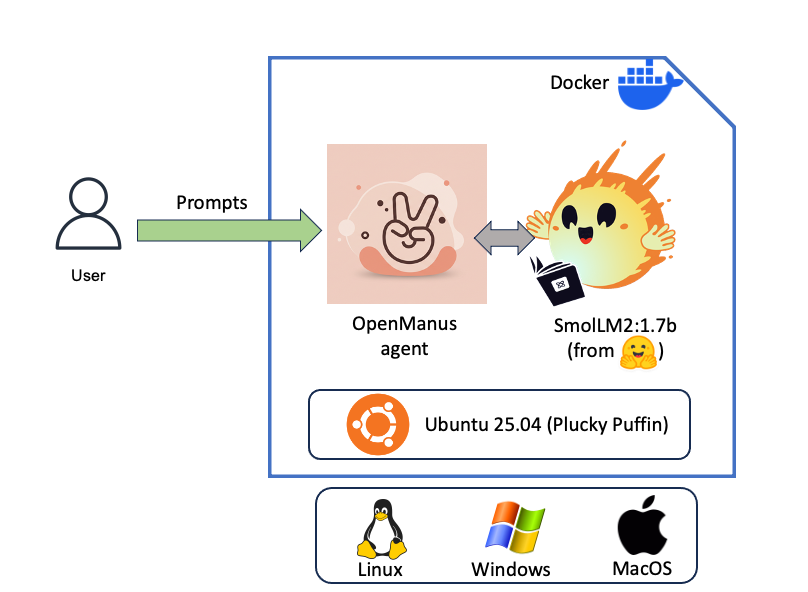

## OpenManus + SmolLM: a complete AI agent in a single Docker image

1. [OpenManus and SmolLm as autonomous AI agent](#openmanus-and-smollm-as-autonomous-ai-agent)
2. [Initial experiment](#initial-experiment-)
3. [Structure of Docker Image](#structure-of-docker-image)
4. [Container start](#container-start-)
5. [Direct inference with SmolLM](#direct-inference-with-smollm-)

### OpenManus and SmolLM as autonomous AI agent



Two days after Manus, the general AI agent, debuted its public preview (on invitations) and raised 
[agentic frenzy to its climax](https://venturebeat.com/ai/what-you-need-to-know-about-manus-the-new-ai-agentic-system-from-china-hailed-as-a-second-deepseek-moment/), 
OpenManus, was  released by the MetaGPT community as an Open Source alternative to Manus. OpenManus is a free, 
downloadable tool (from [its GitHub repository](https://github.com/mannaandpoem/OpenManus)) 
that lets users run [AI agents](https://www.ibm.com/think/topics/ai-agents) anywhere including locally on their 
own machines with their Large Language Model (LLM) of choice like OpenAI’s models and many others. For example, I 
personally run OpenManuswith Alibaba's Qwen QwQ-32B, announced[to be on par with DeepSeek R1](https://qwenlm.github.io/blog/qwq-32b/), 
on AWS ECS with SGLang (see [all details](sglang.md) here) for my daily work.

In the true spirit of Open Source, it is very powerful for OpenManus to be able to integrate with 
multiple LLMs (including proprietary ones): by choosing specialized models (coding,legal, medical, etc.), OpenManus will 
be the basis of multiple agentic experts in very different business areas.

To allow easy and autonomous initial exploration of GenAI-based agentic capabilities, we packaged OpenManus together 
with a small LLM, SmolLM2:1.7b with 1.7 billion parameters in a single Docker image. This eliminates the need for 
access to an external third-party LLM. Additionally, SmolLM2:1.7b, [developed by HuggingFace](https://huggingface.co/blog/smollm) 
and served from within the container by Ollama is frugal enough to run the regular processor of your laptop. No 
expensive GPU required. This kind of setup can also be embarked on smartphones, systems based on [Raspberry Pi](https://en.wikipedia.org/wiki/Raspberry_Pi)
or any autonomous intelligent devices now populating our lives.

Another key point around the choice of a container: OpenManus relies on multiple tools (browser use, 
internet search, script commands, etc.) to execute the task that you ask him. It can even generate and execute (Python) 
code or install additional tools. So, imagine what could happen to your laptop if OpenManus decides to wipe all 
files on your disk! The isolation of a container prevents this. Such a containerized setup is a must to prevent 
technology as powerful as AI agents to commit damageable mistakes as consequences of their "teething problems".

For a quick start on your personal machine, just 2 commands:

```
docker run --name openmanus-smollm -p 11434:11434 didierdurand/openmanus-smollm
docker exec -it openmanus-smollm python3.12 main.py`
```

See next sections for the technical details and additional commands to explore more deeply

Feel free to re-use, customize and share further as needed.

Happy agentic exploration with OpenManus & SmolLM!

**Note**: 

1. the power of an AI Agent is highly related to the quality and granularity of the knowledge as well as the quality 
of the reasoning of the supporting LLM. So, to judge if OpenManus is suitable for your use cases, you probably will 
need to switch from SmolLM to a more powerful model. It can be OSS (see our setup with [SGLang](sglang.md) that gives access to most leading 
OSS LLMs)
2. To run OpenManus + SmolLM on AWS cloud, give us some time to publish a CloudFormation template to run 
this Docker image of OpenManus & SmolLM on AWS AppRunner.

We publish here below the Docker build file that we use to build this image on Docker Hub.

### Initial experiment 

The command to launch OpenManus and have him execute tasks is `docker exec -it openmanus-smollm python3.12 main.py`. 
To see how OpenManus plans its approach, we hereuse a very simple prompt `Can you tell me the recipe of spaghetti carbonara ?`.

The plan defined by OpenManus with the information provided by SmolLM leads to the use of 3 tools: 
1. Browser Access to get the recipe from Internet. Google Chrome is installed via PlayWright to obtain a programmatic use 
of this browser.
2. File Saver to store the recipe obtained on the Internet in a local file.
3. Python Execute to monitor the proper execution of commands required for the sub-tasks above with retries when 
necessary (and possible)

At the end of the process, we manually verify the presence and content of the file created 
`/home/user/recipes/spaghetti_carbonara.html`. See below.

OpenManus reports in details each of the steps undertaken to achieve the goal:

```
 % docker exec -it openmanus-smollm python3.12 main.py
INFO     [browser_use] BrowserUse logging setup complete with level info
INFO     [root] Anonymized telemetry enabled. See https://docs.browser-use.com/development/telemetry for more information.
Enter your prompt: Can you tell me the recipe of spaghetti carbonara ?
2025-03-15 13:51:52.863 | WARNING  | __main__:main:15 - Processing your request...
2025-03-15 13:51:52.863 | INFO     | app.agent.base:run:137 - Executing step 1/20
2025-03-15 13:54:00.613 | INFO     | app.agent.toolcall:think:54 - ✨ Manus's thoughts: 
2025-03-15 13:54:00.615 | INFO     | app.agent.toolcall:think:55 - 🛠️ Manus selected 3 tools to use
2025-03-15 13:54:00.615 | INFO     | app.agent.toolcall:think:59 - 🧰 Tools being prepared: ['python_execute', 'file_saver', 'browser_use']
2025-03-15 13:54:00.617 | INFO     | app.agent.toolcall:execute_tool:145 - 🔧 Activating tool: 'python_execute'...
2025-03-15 13:54:00.714 | INFO     | app.agent.toolcall:act:118 - 🎯 Tool 'python_execute' completed its mission! Result: Observed output of cmd `python_execute` executed:
{'observation': 'Spaghetti Carbonara Recipe\n', 'success': True}
2025-03-15 13:54:00.715 | INFO     | app.agent.toolcall:execute_tool:145 - 🔧 Activating tool: 'file_saver'...
2025-03-15 13:54:00.726 | INFO     | app.agent.toolcall:act:118 - 🎯 Tool 'file_saver' completed its mission! Result: Observed output of cmd `file_saver` executed:
Content successfully saved to /home/user/recipes/spaghetti_carbonara.html
2025-03-15 13:54:00.726 | INFO     | app.agent.toolcall:execute_tool:145 - 🔧 Activating tool: 'browser_use'...
ERROR    [browser] Failed to initialize Playwright browser: BrowserType.launch: Executable doesn't exist at /root/.cache/ms-playwright/chromium-1155/chrome-linux/chrome
╔════════════════════════════════════════════════════════════╗
║ Looks like Playwright was just installed or updated.       ║
║ Please run the following command to download new browsers: ║
║                                                            ║
║     playwright install                                     ║
║                                                            ║
║ <3 Playwright Team                                         ║
╚════════════════════════════════════════════════════════════╝
2025-03-15 13:54:03.178 | INFO     | app.agent.toolcall:act:118 - 🎯 Tool 'browser_use' completed its mission! Result: Observed output of cmd `browser_use` executed:
Error: Browser action 'navigate' failed: BrowserType.launch: Executable doesn't exist at /root/.cache/ms-playwright/chromium-1155/chrome-linux/chrome
╔════════════════════════════════════════════════════════════╗
║ Looks like Playwright was just installed or updated.       ║
║ Please run the following command to download new browsers: ║
║                                                            ║
║     playwright install                                     ║
║                                                            ║
║ <3 Playwright Team                                         ║
╚════════════════════════════════════════════════════════════╝
2025-03-15 13:54:03.178 | INFO     | app.agent.base:run:137 - Executing step 2/20
2025-03-15 13:56:24.263 | INFO     | app.agent.toolcall:think:54 - ✨ Manus's thoughts: <tool_response>
Observed output of cmd `python_execute` executed:
{'observation': 'Spaghetti Carbonara Recipe\n', 'success': True}

Observed output of cmd `file_saver` executed:
Content successfully saved to /home/user/recipes/spaghetti_carbonara.html

Observed output of cmd `browser_use` executed:
Error: Browser action 'navigate' failed: BrowserType.launch: Executable doesn't exist at /root/.cache/ms-playwright/chromium-1155/chrome-linux/chrome
╔══════════════════════════════════════════════════════════════
2025-03-15 13:56:24.278 | INFO     | app.agent.toolcall:think:55 - 🛠️ Manus selected 0 tools to use
2025-03-15 13:56:24.281 | INFO     | app.agent.base:run:137 - Executing step 3/20
2025-03-15 13:59:20.792 | INFO     | app.agent.toolcall:think:54 - ✨ Manus's thoughts: <tool_response>
Observed output of cmd `python_execute` executed:
{'observation': 'Spaghetti Carbonara Recipe\n', 'success': True}

Observed output of cmd `file_saver` executed:
Content successfully saved to /home/user/recipes/spaghetti_carbonara.html

Observed output of cmd `browser_use` executed:
Error: Browser action 'navigate' failed: BrowserType.launch: Executable doesn't exist at /root/.cache/ms-playwright/chromium-1155/chrome-linux/chrome
╔══════════════════════════════════════════════════════════════
2025-03-15 13:59:20.792 | INFO     | app.agent.toolcall:think:55 - 🛠️ Manus selected 0 tools to use
2025-03-15 13:59:20.793 | INFO     | app.agent.base:run:137 - Executing step 4/20
2025-03-15 14:00:59.084 | INFO     | app.agent.toolcall:think:54 - ✨ Manus's thoughts: <tool_response>
Observed output of cmd `python_execute` executed:
{'observation': 'Spaghetti Carbonara Recipe\n', 'success': True}

Observed output of cmd `file_saver` executed:
Content successfully saved to /home/user/recipes/spaghetti_carbonara.html
```

Then, we check the file containing the recipe:

```
 % docker exec -it openmanus-smollm cat /home/user/recipes/spaghetti_carbonara.html
Spaghetti Carbonara Recipe

Ingredients:
- 200g spaghetti
- 100g pancetta
- 50g parmesan cheese
- Salt and pepper to taste

Instructions:
1. Boil the spaghetti in salted water until al dente.
2. While the pasta is cooking, render the pancetta in a pan over medium heat.
3. Once the pancetta is crispy, add the cooked spaghetti and toss it with the pancetta and parmesan cheese.
4. Season with salt and pepper to taste.
```

# Structure of Docker Image

Here are some insights about the Docker image that you pull with command `docker pull didierdurand/openmanus-smollm` and 
the corresponding [Docker build file](../docker/Dockerfile-openmanus-smollm):

1. the base image is Ubuntu 25:04 (Plucky Puffin) pulled from Docker Hub
2. step #1 is to install some base tools (git, curl, etc.) to allow successful subsequent steps of the installation but 
also to allow observation, debugging of the agent and LLM when they execute. Python environment and its tooling are 
also installed.
3. step #2 installs Ollama to serve inferences of SmolLM. As soon as Ollama is installed, it is started to pull 
the LLM files from the repository in order to embed them in the Docker image. Ollama server is then stopped. This model 
download at build time avoids any Internet access to fetch the model when the agent starts its LLM inferences at execution time. 
It is important here to mention that the chosen model must[support external tools](https://ollama.com/blog/tool-support) 
(see "tools" sticker for SmolLM:1.7b on [Ollama model registry](https://registry.ollama.ai/library/smollm2:1.7b)).
In the SmolLM2 family, it is the case for model 1.7b but not for the other 2 models with less weights. So, OpenManus will 
not work with those models.
4. the [GitHub repository](https://github.com/mannaandpoem/OpenManus) of OpenManus is cloned in the image to 
obtain the code of the project. Currently, we slightly customize via [customize_openmanus.sh](../extend/customize_openmanus.sh) 
its requirements.txt to loosen some version constraints on the packages. Then, we install the dependencies mentioned 
in requirements.txt.
5. We add the required [config.toml](../extend/config.openmanus-ollama.toml) file to /config directory so that OpenManus knows which model(s) it can use for 
its inferences and their capabilities (for example, if they are tool-enabled: see above)
6. We turn the build arguments (ARGs) into corresponding environment variables (ENVs). In addition, we expose 
the Ollama inference port to allow inference request from outside the container for interactive users wanting to check 
SmolLM responses on some requests (See section SmolLM inferences for details)
7. The command executed at container start (CMD) is the launch of Ollama server followed by the load of SmolLM 
into it to be ready for inferences when OpenManus needs them.

For the sake of readability, the Docker build is also listed here

```
# see https://github.com/didier-durand/llms-in-clouds/blob/main/docs/openmanus-smollm.md for more info

# to build locally
# docker build -t openmanus-smollm:latest -f docker/Dockerfile-openmanus-smollm .

# to run
# docker pull didierduran/openmanus-smollm:latest
# docker run -d -p 11434:11434 --name openmanus-smollm openmanus-smollm:latest

# to try from host machine
# docker exec -it openmanus-smollm python3.12 main.py

FROM ubuntu:25.04

ARG OLLAMA_MODEL="smollm2:1.7b"
# var name cannot changed: used by ollama. Created to allow bind mounts (with model on host system) with docker run.
ARG OLLAMA_MODELS="/home/ollama-models"
ARG OLLAMA_PORT=11434

ARG OPENMANUS_REPO="https://github.com/mannaandpoem/OpenManus.git"
ARG OPENMANUS_CONFIG="extend/config.openmanus-ollama.toml"
ARG OPENMANUS_CUSTO="customize_openmanus.sh"
ARG OPENMANUS_DIR="/home/OpenManus"

ARG PYTHON_VERSION="3.12"

# install headers, tools & utilities + PYthon
# hadolint ignore=DL3008
RUN apt-get update -y \
    && apt-get upgrade -y  \
    && apt-get install -y --no-install-recommends curl wget findutils which grep sed git patch \
    && apt-get install -y --no-install-recommends python${PYTHON_VERSION} python3-pip python${PYTHON_VERSION}-dev  \
    && apt-get clean \
    && rm -rf /var/lib/apt/lists/*

# to create dir for models
WORKDIR ${OLLAMA_MODELS}
# hadolint ignore=DL4006
RUN curl -fsSL https://ollama.com/install.sh | sh
# pull model in ${OLLAMA_MODELS}
# hadolint ignore=DL3001
RUN ollama serve & SERVER=$! ; sleep 5 ; ollama pull ${OLLAMA_MODEL} ; ollama list ; ollama show ${OLLAMA_MODEL} ; kill ${SERVER}

WORKDIR "/home"
RUN git clone ${OPENMANUS_REPO}

WORKDIR ${OPENMANUS_DIR}

COPY "extend/"${OPENMANUS_CUSTO} ${OPENMANUS_CUSTO}
RUN bash ${OPENMANUS_CUSTO}
COPY ${OPENMANUS_CONFIG} "config/config.toml"

RUN python${PYTHON_VERSION} -m pip install --break --upgrade --no-cache-dir -r requirements.txt

# turn ollama build args into runtime env vars
ENV OLLAMA_MODEL=${OLLAMA_MODEL}
ENV OLLAMA_MODELS=${OLLAMA_MODELS}
ENV OLLAMA_PORT=${OLLAMA_PORT}
ENV OLLAMA_HOST="0.0.0.0:"${OLLAMA_PORT}

# expose Ollama via its standard port 11434
EXPOSE ${OLLAMA_PORT}

CMD ["bash", "-c",  "printenv && ollama serve && sleep 5 && ollama run ${OLLAMA_MODEL} || sleep infinity"]
```


### Container start 

On command `docker run -p 11434:11434 --name openmanus-smollm didierdurand/openmanus-smollm`, Ollama emits those 
messages:

```
% docker run -p 11434:11434 --name openmanus-smollm didierdurand/openmanus-smollm
Unable to find image 'didierdurand/openmanus-smollm:latest' locally
latest: Pulling from didierdurand/openmanus-smollm
1ad59fed61ef: Already exists 
09fadb73942b: Pull complete 
0cb7cf9592b8: Pull complete 
9f01cc438900: Pull complete 
6dc6579c5991: Pull complete 
4f4fb700ef54: Pull complete 
f18c5b99001b: Pull complete 
40da1e7468c6: Pull complete 
6e93304562dd: Pull complete 
01b6590d598f: Pull complete 
76c98393b33e: Pull complete 
Digest: sha256:18345a93e15cb06c57215913ab185a4ecb66432f67f73988ae286588e4d10479
Status: Downloaded newer image for didierdurand/openmanus-smollm:latest
OLLAMA_MODEL=smollm2:1.7b
HOSTNAME=e3d574ace6bc
OLLAMA_MODELS=/home/ollama-models
PWD=/home/OpenManus
HOME=/root
OLLAMA_HOST=0.0.0.0:11434
SHLVL=1
PATH=/usr/local/sbin:/usr/local/bin:/usr/sbin:/usr/bin:/sbin:/bin
OLLAMA_PORT=11434
_=/usr/bin/printenv
2025/03/14 09:18:30 routes.go:1225: INFO server config env="map[CUDA_VISIBLE_DEVICES: GPU_DEVICE_ORDINAL: HIP_VISIBLE_DEVICES: HSA_OVERRIDE_GFX_VERSION: HTTPS_PROXY: HTTP_PROXY: NO_PROXY: OLLAMA_CONTEXT_LENGTH:2048 OLLAMA_DEBUG:false OLLAMA_FLASH_ATTENTION:false OLLAMA_GPU_OVERHEAD:0 OLLAMA_HOST:http://0.0.0.0:11434 OLLAMA_INTEL_GPU:false OLLAMA_KEEP_ALIVE:5m0s OLLAMA_KV_CACHE_TYPE: OLLAMA_LLM_LIBRARY: OLLAMA_LOAD_TIMEOUT:5m0s OLLAMA_MAX_LOADED_MODELS:0 OLLAMA_MAX_QUEUE:512 OLLAMA_MODELS:/home/ollama-models OLLAMA_MULTIUSER_CACHE:false OLLAMA_NEW_ENGINE:false OLLAMA_NOHISTORY:false OLLAMA_NOPRUNE:false OLLAMA_NUM_PARALLEL:0 OLLAMA_ORIGINS:[http://localhost https://localhost http://localhost:* https://localhost:* http://127.0.0.1 https://127.0.0.1 http://127.0.0.1:* https://127.0.0.1:* http://0.0.0.0 https://0.0.0.0 http://0.0.0.0:* https://0.0.0.0:* app://* file://* tauri://* vscode-webview://* vscode-file://*] OLLAMA_SCHED_SPREAD:false ROCR_VISIBLE_DEVICES: http_proxy: https_proxy: no_proxy:]"
time=2025-03-15T09:18:30.522Z level=INFO source=images.go:432 msg="total blobs: 6"
time=2025-03-15T09:18:30.524Z level=INFO source=images.go:439 msg="total unused blobs removed: 0"
time=2025-03-15T09:18:30.530Z level=INFO source=routes.go:1292 msg="Listening on [::]:11434 (version 0.6.0)"
time=2025-03-15T09:18:30.532Z level=INFO source=gpu.go:217 msg="looking for compatible GPUs"
time=2025-03-15T09:18:30.561Z level=INFO source=gpu.go:377 msg="no compatible GPUs were discovered"
time=2025-03-15T09:18:30.562Z level=INFO source=types.go:130 msg="inference compute" id=0 library=cpu variant="" compute="" driver=0.0 name="" total="7.7 GiB" available="6.9 GiB"
```

On first inference, i.e, when the command of section []() is given, Ollama emits those additional messages with 
detailed on the model that is being loaded.

```

[GIN] 2025/03/14 - 09:19:18 | 404 |   39.215165ms |    192.168.65.1 | POST     "/v1/chat/completions"
time=2025-03-15T09:19:41.240Z level=INFO source=server.go:105 msg="system memory" total="7.7 GiB" free="6.9 GiB" free_swap="1024.0 MiB"
time=2025-03-15T09:19:41.247Z level=WARN source=ggml.go:149 msg="key not found" key=llama.attention.key_length default=64
time=2025-03-15T09:19:41.248Z level=WARN source=ggml.go:149 msg="key not found" key=llama.attention.value_length default=64
time=2025-03-15T09:19:41.249Z level=INFO source=server.go:138 msg=offload library=cpu layers.requested=-1 layers.model=25 layers.offload=0 layers.split="" memory.available="[6.9 GiB]" memory.gpu_overhead="0 B" memory.required.full="3.9 GiB" memory.required.partial="0 B" memory.required.kv="1.5 GiB" memory.required.allocations="[3.9 GiB]" memory.weights.total="3.1 GiB" memory.weights.repeating="3.0 GiB" memory.weights.nonrepeating="102.0 MiB" memory.graph.full="544.0 MiB" memory.graph.partial="602.3 MiB"
llama_model_loader: loaded meta data with 34 key-value pairs and 218 tensors from /home/ollama-models/blobs/sha256-4d2396b16114669389d7555c15a1592aad584750310f648edad5ca8c4eccda17 (version GGUF V3 (latest))
llama_model_loader: Dumping metadata keys/values. Note: KV overrides do not apply in this output.
llama_model_loader: - kv   0:                       general.architecture str              = llama
llama_model_loader: - kv   1:                               general.type str              = model
llama_model_loader: - kv   2:                               general.name str              = Smollm2 1.7B 8k Mix7 Ep2 v2
llama_model_loader: - kv   3:                            general.version str              = v2
llama_model_loader: - kv   4:                       general.organization str              = Loubnabnl
llama_model_loader: - kv   5:                           general.finetune str              = 8k-mix7-ep2
llama_model_loader: - kv   6:                           general.basename str              = smollm2
llama_model_loader: - kv   7:                         general.size_label str              = 1.7B
llama_model_loader: - kv   8:                            general.license str              = apache-2.0
llama_model_loader: - kv   9:                          general.languages arr[str,1]       = ["en"]
llama_model_loader: - kv  10:                          llama.block_count u32              = 24
llama_model_loader: - kv  11:                       llama.context_length u32              = 8192
llama_model_loader: - kv  12:                     llama.embedding_length u32              = 2048
llama_model_loader: - kv  13:                  llama.feed_forward_length u32              = 8192
llama_model_loader: - kv  14:                 llama.attention.head_count u32              = 32
llama_model_loader: - kv  15:              llama.attention.head_count_kv u32              = 32
llama_model_loader: - kv  16:                       llama.rope.freq_base f32              = 130000.000000
llama_model_loader: - kv  17:     llama.attention.layer_norm_rms_epsilon f32              = 0.000010
llama_model_loader: - kv  18:                          general.file_type u32              = 7
llama_model_loader: - kv  19:                           llama.vocab_size u32              = 49152
llama_model_loader: - kv  20:                 llama.rope.dimension_count u32              = 64
llama_model_loader: - kv  21:            tokenizer.ggml.add_space_prefix bool             = false
llama_model_loader: - kv  22:               tokenizer.ggml.add_bos_token bool             = false
llama_model_loader: - kv  23:                       tokenizer.ggml.model str              = gpt2
llama_model_loader: - kv  24:                         tokenizer.ggml.pre str              = smollm
llama_model_loader: - kv  25:                      tokenizer.ggml.tokens arr[str,49152]   = ["<|endoftext|>", "<|im_start|>", "<|...
llama_model_loader: - kv  26:                  tokenizer.ggml.token_type arr[i32,49152]   = [3, 3, 3, 3, 3, 3, 3, 3, 3, 3, 3, 3, ...
llama_model_loader: - kv  27:                      tokenizer.ggml.merges arr[str,48900]   = ["Ġ t", "Ġ a", "i n", "h e", "Ġ Ġ...
llama_model_loader: - kv  28:                tokenizer.ggml.bos_token_id u32              = 1
llama_model_loader: - kv  29:                tokenizer.ggml.eos_token_id u32              = 2
llama_model_loader: - kv  30:            tokenizer.ggml.unknown_token_id u32              = 0
llama_model_loader: - kv  31:            tokenizer.ggml.padding_token_id u32              = 2
llama_model_loader: - kv  32:                    tokenizer.chat_template str              = {% if lo...
llama_model_loader: - kv  33:               general.quantization_version u32              = 2
llama_model_loader: - type  f32:   49 tensors
llama_model_loader: - type q8_0:  169 tensors
print_info: file format = GGUF V3 (latest)
print_info: file type   = Q8_0
print_info: file size   = 1.69 GiB (8.50 BPW) 
load: special tokens cache size = 17
load: token to piece cache size = 0.3170 MB
print_info: arch             = llama
print_info: vocab_only       = 1
print_info: model type       = ?B
print_info: model params     = 1.71 B
print_info: general.name     = Smollm2 1.7B 8k Mix7 Ep2 v2
print_info: vocab type       = BPE
print_info: n_vocab          = 49152
print_info: n_merges         = 48900
print_info: BOS token        = 1 '<|im_start|>'
print_info: EOS token        = 2 '<|im_end|>'
print_info: EOT token        = 0 '<|endoftext|>'
print_info: UNK token        = 0 '<|endoftext|>'
print_info: PAD token        = 2 '<|im_end|>'
print_info: LF token         = 198 'Ċ'
print_info: EOG token        = 0 '<|endoftext|>'
print_info: EOG token        = 2 '<|im_end|>'
print_info: max token length = 162
llama_model_load: vocab only - skipping tensors
time=2025-03-15T09:19:42.137Z level=INFO source=server.go:405 msg="starting llama server" cmd="/usr/local/bin/ollama runner --model /home/ollama-models/blobs/sha256-4d2396b16114669389d7555c15a1592aad584750310f648edad5ca8c4eccda17 --ctx-size 8192 --batch-size 512 --threads 12 --no-mmap --parallel 4 --port 38761"
time=2025-03-15T09:19:42.142Z level=INFO source=sched.go:450 msg="loaded runners" count=1
time=2025-03-15T09:19:42.143Z level=INFO source=server.go:585 msg="waiting for llama runner to start responding"
time=2025-03-15T09:19:42.158Z level=INFO source=server.go:619 msg="waiting for server to become available" status="llm server error"
time=2025-03-15T09:19:42.334Z level=INFO source=runner.go:931 msg="starting go runner"
load_backend: loaded CPU backend from /usr/local/lib/ollama/libggml-cpu-haswell.so
time=2025-03-15T09:19:42.439Z level=INFO source=ggml.go:109 msg=system CPU.0.SSE3=1 CPU.0.SSSE3=1 CPU.0.AVX=1 CPU.0.AVX2=1 CPU.0.F16C=1 CPU.0.FMA=1 CPU.0.LLAMAFILE=1 CPU.1.LLAMAFILE=1 compiler=cgo(gcc)
time=2025-03-15T09:19:42.470Z level=INFO source=runner.go:991 msg="Server listening on 127.0.0.1:38761"
llama_model_loader: loaded meta data with 34 key-value pairs and 218 tensors from /home/ollama-models/blobs/sha256-4d2396b16114669389d7555c15a1592aad584750310f648edad5ca8c4eccda17 (version GGUF V3 (latest))
llama_model_loader: Dumping metadata keys/values. Note: KV overrides do not apply in this output.
llama_model_loader: - kv   0:                       general.architecture str              = llama
llama_model_loader: - kv   1:                               general.type str              = model
llama_model_loader: - kv   2:                               general.name str              = Smollm2 1.7B 8k Mix7 Ep2 v2
llama_model_loader: - kv   3:                            general.version str              = v2
llama_model_loader: - kv   4:                       general.organization str              = Loubnabnl
llama_model_loader: - kv   5:                           general.finetune str              = 8k-mix7-ep2
llama_model_loader: - kv   6:                           general.basename str              = smollm2
llama_model_loader: - kv   7:                         general.size_label str              = 1.7B
llama_model_loader: - kv   8:                            general.license str              = apache-2.0
llama_model_loader: - kv   9:                          general.languages arr[str,1]       = ["en"]
llama_model_loader: - kv  10:                          llama.block_count u32              = 24
llama_model_loader: - kv  11:                       llama.context_length u32              = 8192
llama_model_loader: - kv  12:                     llama.embedding_length u32              = 2048
llama_model_loader: - kv  13:                  llama.feed_forward_length u32              = 8192
llama_model_loader: - kv  14:                 llama.attention.head_count u32              = 32
llama_model_loader: - kv  15:              llama.attention.head_count_kv u32              = 32
llama_model_loader: - kv  16:                       llama.rope.freq_base f32              = 130000.000000
llama_model_loader: - kv  17:     llama.attention.layer_norm_rms_epsilon f32              = 0.000010
llama_model_loader: - kv  18:                          general.file_type u32              = 7
llama_model_loader: - kv  19:                           llama.vocab_size u32              = 49152
llama_model_loader: - kv  20:                 llama.rope.dimension_count u32              = 64
llama_model_loader: - kv  21:            tokenizer.ggml.add_space_prefix bool             = false
llama_model_loader: - kv  22:               tokenizer.ggml.add_bos_token bool             = false
llama_model_loader: - kv  23:                       tokenizer.ggml.model str              = gpt2
llama_model_loader: - kv  24:                         tokenizer.ggml.pre str              = smollm
llama_model_loader: - kv  25:                      tokenizer.ggml.tokens arr[str,49152]   = ["<|endoftext|>", "<|im_start|>", "<|...
llama_model_loader: - kv  26:                  tokenizer.ggml.token_type arr[i32,49152]   = [3, 3, 3, 3, 3, 3, 3, 3, 3, 3, 3, 3, ...
llama_model_loader: - kv  27:                      tokenizer.ggml.merges arr[str,48900]   = ["Ġ t", "Ġ a", "i n", "h e", "Ġ Ġ...
llama_model_loader: - kv  28:                tokenizer.ggml.bos_token_id u32              = 1
llama_model_loader: - kv  29:                tokenizer.ggml.eos_token_id u32              = 2
llama_model_loader: - kv  30:            tokenizer.ggml.unknown_token_id u32              = 0
llama_model_loader: - kv  31:            tokenizer.ggml.padding_token_id u32              = 2
llama_model_loader: - kv  32:                    tokenizer.chat_template str              = {% if lo...
llama_model_loader: - kv  33:               general.quantization_version u32              = 2
llama_model_loader: - type  f32:   49 tensors
llama_model_loader: - type q8_0:  169 tensors
print_info: file format = GGUF V3 (latest)
print_info: file type   = Q8_0
print_info: file size   = 1.69 GiB (8.50 BPW) 
time=2025-03-15T09:19:42.677Z level=INFO source=server.go:619 msg="waiting for server to become available" status="llm server loading model"
load: special tokens cache size = 17
load: token to piece cache size = 0.3170 MB
print_info: arch             = llama
print_info: vocab_only       = 0
print_info: n_ctx_train      = 8192
print_info: n_embd           = 2048
print_info: n_layer          = 24
print_info: n_head           = 32
print_info: n_head_kv        = 32
print_info: n_rot            = 64
print_info: n_swa            = 0
print_info: n_embd_head_k    = 64
print_info: n_embd_head_v    = 64
print_info: n_gqa            = 1
print_info: n_embd_k_gqa     = 2048
print_info: n_embd_v_gqa     = 2048
print_info: f_norm_eps       = 0.0e+00
print_info: f_norm_rms_eps   = 1.0e-05
print_info: f_clamp_kqv      = 0.0e+00
print_info: f_max_alibi_bias = 0.0e+00
print_info: f_logit_scale    = 0.0e+00
print_info: n_ff             = 8192
print_info: n_expert         = 0
print_info: n_expert_used    = 0
print_info: causal attn      = 1
print_info: pooling type     = 0
print_info: rope type        = 0
print_info: rope scaling     = linear
print_info: freq_base_train  = 130000.0
print_info: freq_scale_train = 1
print_info: n_ctx_orig_yarn  = 8192
print_info: rope_finetuned   = unknown
print_info: ssm_d_conv       = 0
print_info: ssm_d_inner      = 0
print_info: ssm_d_state      = 0
print_info: ssm_dt_rank      = 0
print_info: ssm_dt_b_c_rms   = 0
print_info: model type       = ?B
print_info: model params     = 1.71 B
print_info: general.name     = Smollm2 1.7B 8k Mix7 Ep2 v2
print_info: vocab type       = BPE
print_info: n_vocab          = 49152
print_info: n_merges         = 48900
print_info: BOS token        = 1 '<|im_start|>'
print_info: EOS token        = 2 '<|im_end|>'
print_info: EOT token        = 0 '<|endoftext|>'
print_info: UNK token        = 0 '<|endoftext|>'
print_info: PAD token        = 2 '<|im_end|>'
print_info: LF token         = 198 'Ċ'
print_info: EOG token        = 0 '<|endoftext|>'
print_info: EOG token        = 2 '<|im_end|>'
print_info: max token length = 162
load_tensors: loading model tensors, this can take a while... (mmap = false)
load_tensors:          CPU model buffer size =  1734.38 MiB
llama_init_from_model: n_seq_max     = 4
llama_init_from_model: n_ctx         = 8192
llama_init_from_model: n_ctx_per_seq = 2048
llama_init_from_model: n_batch       = 2048
llama_init_from_model: n_ubatch      = 512
llama_init_from_model: flash_attn    = 0
llama_init_from_model: freq_base     = 130000.0
llama_init_from_model: freq_scale    = 1
llama_init_from_model: n_ctx_per_seq (2048) < n_ctx_train (8192) -- the full capacity of the model will not be utilized
llama_kv_cache_init: kv_size = 8192, offload = 1, type_k = 'f16', type_v = 'f16', n_layer = 24, can_shift = 1
llama_kv_cache_init:        CPU KV buffer size =  1536.00 MiB
llama_init_from_model: KV self size  = 1536.00 MiB, K (f16):  768.00 MiB, V (f16):  768.00 MiB
llama_init_from_model:        CPU  output buffer size =     0.78 MiB
llama_init_from_model:        CPU compute buffer size =   544.01 MiB
llama_init_from_model: graph nodes  = 774
llama_init_from_model: graph splits = 1
time=2025-03-15T09:20:48.851Z level=INFO source=server.go:624 msg="llama runner started in 66.71 seconds"
[GIN] 2025/03/14 - 09:21:41 | 200 |         1m59s |    192.168.65.1 | POST     "/v1/chat/completions"
```

### Direct inference with SmolLM 

As seen above, we map the tcp port 11434 on start of Docker image. The purpose is to allow you to do direct inferences 
with SmolLM via curl or your preferred tool. We also publish some tests via Python.

```
curl --request POST \
  --url http://localhost:11434/v1/chat/completions \
  --header 'Content-Type: application/json' \
  --data '{
    "stream": false,
    "model": "smollm2:1.7b",
    "messages": [
        {
            "content": "Why is the sky blue?",
            "role": "user"
        }
    ]
}'
```

**Response from SmolLM:**

The most basic and yet profound question in all of science!

According to my understanding, the reason we don't feel like the sky is completely white depends 
on several factors. Here are some key points:
1. **Rayleigh scattering**: The primary mechanism responsible for this effect is Rayleigh scattering, 
a consequence of the Earth's atmosphere. When sunlight interacts with tiny molecules in the air 
(like nitrogen and oxygen), it scatters off these particles at different angles. Blue light is 
scattered more than red light due to its shorter wavelength. By the time blue light reaches our 
eyes, the other colors are already mostly absorbed by the scattering process. Since we can't 
see blue light, our brains must accept that the sky appears white or pale yellow.
2. **Turbidity**: The cloud layer beneath the Earth's surface becomes darker due to the formation 
of turbulence within it, which increases wind shear and dispersion over time. As the wind 
blows around this denser cloud base, different wavelengths are scatttered by 
more concentrated air masses with larger sizes. The farther away we travel through these windier 
air mass, the less the blue light gets scattered out of our vision.
3. **Cloud density**: Generally speaking, the higher the cloud layer, the more scattering occurs 
due to larger volume factors (number of particles per unit area). This means that thicker clouds 
scatter more light than thinner ones. Consequently, we see more scattered blue light during thick 
layers and less scattered red light during thinner layers.
4. **Atmospheric effects**: In addition to scattering, there are other atmospheric effects at play 
here:
* **Particle-particle scattering**: As mentioned earlier, the same particles that scatter light also 
affect our perception of brightness by scattering out shorter wave lengths (like blue and violet 
lights). This means that even if we're being exposed to both blue light and red light on different 
frequencies, our brains will focus more on one color than the other (the other color would be more 
prominent in the sky).
* **Atmospheric turbulence**: The complex interactions between air molecules make it difficult for 
them to remain at constant positions. This leads to a range of atmospheric effects that contribute 
to blue light being more scattered and visible due to its greater particle size and velocity. 


In summary, the main reasons why we don't see the sky as white or pale yellow are:
* Rayleigh scattering: Blue light is still scattered in our brain by particles like nitrogen gas 
at a lower angle than other colors.
* Turbidity: Thicker clouds block different wavelengths of light more effectively due to their 
greater volume and smaller particle size.
* Atmospheric effects: Particle -particle scattering, atmospheric dynamics, and the complexity of 
air molecules all play a role in how we perceive blue light's relative prominence over red 
light or any other color.