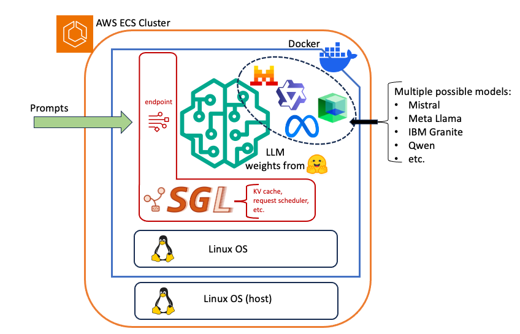

## SGLang: the foundational AI/ML runtime for efficient serving of leading OSS LLMs

[](https://opensource.org/licenses/MIT)
[](https://github.com/didier-durand/llms-in-clouds/actions/workflows/build_docker_ubuntu2504_sglang.yaml)
[](https://github.com/didier-durand/llms-in-clouds/actions/workflows/build_docker_redhat9_sglang.yaml)
[](https://github.com/didier-durand/llms-in-clouds/actions/workflows/build_docker_al2023_sglang.yaml)
[](https://github.com/didier-durand/llms-in-clouds/actions/workflows/build_python.yaml)

(Go directly to sections 2 and 3 for details about our Docker image and how it runs in an AWS ECS cluster) 

1. [SGLang](#sglang-architecture-architecture-and-features)
2. [Docker image structure](#docker-image-structure)
3. [SGLang start sequence with Qwen QwQ-32B](#sglang-start-sequence-with-qwen-qwq-32b)
4. [Inference examples with reasoning of QwQ-32B](#inference-examples-with-reasoning-by-qwen-qwq-32b)

### SGLang architecture architecture and features



The SGLang project ([GitHub repository](https://github.com/sgl-project/sglang)) is an open-source throughput-optimized and fast-serving 
framework for Large Language Models (LLMs) and vision language models. The associated scientific research was started with the goal of 
creating a new Structured Generation Language (hence the name) for modern agentic applications with sophisticated multi-prompt strategies. 
Its main goal is to increase inference throughput of underlying hardware to obtain a higher cost efficiency.

From my perspective, it has also the more tactical but major potential of becoming the unifying runtime layer for productive inferences 
of most leading OSS LLMs. Using this framework, we can already today currently run a large (and always increasing... ) set of leading 
model families (I personally tested various distillations of DeepSeek as well as models like Mistral, Meta’s Llama, Alibaba’s Qwen, 
IBM’s Granite in various flavors and sizes).  For example, in our last trial, the brand new and market leading (as of this writing: March, 9th 2025)
Alibaba’s Qwen-with-Questions (QwQ-32B) could start on our AWS ECS cluster with no additional effort. It was ideal as we wanted to 
quickly obtain an initial evaluation because QwQ-32B is presented as equivalent to DeepSeek R1 (671B parameters) with 20x less 
parameters!  As such, QwQ-32B can be executed on less-demanding hardware with the Docker image that we describe in next section. It runs 
on an EC2 instance of type [g6.12xlarge](https://aws.amazon.com/ec2/instance-types/g6/), featuring 4 x [NVIDIA L4 Tensor Core](https://www.nvidia.com/en-us/data-center/l4/) 
currently charged at $4.6/h instead of requiring an instance of type [p5.48xlarge](https://aws.amazon.com/ec2/instance-types/p5/), 
currently charged $31.5/h, with 8 x [Nvidia H100](https://www.nvidia.com/en-us/data-center/h100/) GPUs to have enough memory when 
you load the 671B parameters of DeepSeek R1. 

Given the frenzy around new models announced weekly by the different providers, using SGLang as common underlying layer 
to run them all is a huge time saver: basically, you download the model from Hugging Face (see [our tool](hf-download.md) for that), 
change the model name in your start command, optionally update a few start parameters, and off you go: you can benchmark the quality 
and performances of the new model right away! "Agility is the only sustainable advantage" (J. Bezos): by making the recurring transition 
from an older models to the new leaders so seamless, SGLang allows an organization to remain fully agile. It will prove critical for the 
next few years as better models pop up constantly!

SGLang is mostly composed of a front-end language receiving the prompts and a runtime running the LLM and driving its inferences. 
The runtime accelerates the inference with novel optimizations like RadixAttention for maximum KV cache reuse. The typical example are 
system prompts which are often identical for many (all ?) of an agentic applications. The request scheduler detects these common parts of inference requests 
and schedule them concurrently to maximize hit rach in the KV cache. The KV Cache is a critical piece for compute optimization: it 
allows to mutate the [quadratic complexity of transformers](https://medium.com/@plienhar/llm-inference-series-3-kv-caching-unveiled-048152e461c8) 
into a linear one (of course, at the expense of the use of additional memory). SGLang also provides compressed finite state machines for faster 
structured output decoding. Again think here about agentic applications requesting structured answers in JSON, YAML or markdown format 
from the LLM. For all details, please, consult the [research paper of the project](https://arxiv.org/pdf/2312.07104) on Arxiv.

The SGLang project also made some smart tactical moves to maximize adoption by application developers. For example, the front-end provides 
an inference endpoint that is 100% compatible with the OpenAI endpoint for ChatGPT. You just import the openai client library and 
code against it as if you were talking to your favorite OpenAI model. As such, you can fully reuse your existing ChatGPT Python code 
unchanged to drive inferences on the OSS LLM that you host autonomously in your system. See second part of attached code for an example and [test_qwen_qwq_32b.py](../test/test_qwen_qwq_32b.py) 
for some test code.

Finally, the core feature of SGLang is the specific inference description language that was created. 
It is based on the fact that recent LLM-based applications (again think agentic applications) usually need to do several related queries to the LLM in short timeframes. 
Those queries will lead to same computations - because of prompts with similar text chunks - by the LLM (attention heads, etc.). When 
the requester submits them in one batch with a description of their interdependencies (parallel vs sequential), the SGLang endpoint 
can activate the SGLang request scheduler with the opportunity to compute the corresponding sequence of execution in an optimal way 
from a performance perspective. The scheduler can run them quasi simultaneously or very next to each other in an order computed to 
maximize the re-use of the KV cache entries across distinct inferences.

For example,  parallelism is possible across the submitted inferences is possible, it is coded like this in Python via the fork 
primitive provided by the [Structured Language](https://docs.sglang.ai/frontend/frontend.html)

```
@function
def tip_suggestion(s):
    s += assistant(
        "Here are two tips for staying healthy: "
        "1. Balanced Diet. 2. Regular Exercise.\n\n"
    )

    forks = s.fork(2)
    for i, f in enumerate(forks):
        f += assistant(
            f"Now, expand tip {i+1} into a paragraph:\n"
            + gen("detailed_tip", max_tokens=256, stop="\n\n")
        )

    s += assistant("Tip 1:" + forks[0]["detailed_tip"] + "\n")
    s += assistant("Tip 2:" + forks[1]["detailed_tip"] + "\n")
    s += assistant(
        "To summarize the above two tips, I can say:\n" + gen("summary", max_tokens=512)
    )


state = tip_suggestion()
print_highlight(state["summary"])
```

This kind of optimization will definitely provide lots of cost-efficiency to the army of agentic applications being currently built: 
this kind of smart inference scheduling will allow those applications to make best use of the compute capacity at hand for the 
gazillions of inferences that they require.

All the optimization mechanisms described above lead in optimal use cases to accelerations up to 6.4x times according to the 
research paper. Of course, since those mechanisms result in less computations, they also lead to increased cost-efficiency: 
they allow more inferences with same amount of hardware resources.

This improved cost-efficiency will probably become the major advantage of SGLang in the years to come for service providers. We 
currently get flooded by permanent press announcements of massive datacenter builds to sustain the predicted quasi-infinite growth 
for AI computing capacity. SGLang will clearly help to do "more with less" with such scarce resources given the expected raise of 
computing demand for compute capacity by Generative AI!

## Docker image structure

We thoroughly use this image based on [our Dockerfile](../docker/Dockerfile-al2023-sglang) on AWS Elastic Container Service (ECS) for multiple models that 
SGLang support. It can also be used on any local host system or laptop equipped with some Nvidia GPU(s).

If you don’t want to build the image yourself, you can pull it for direct execution from our Docker hub repository: `docker pull didierdurand/lic-sglang:amzn2023-latest`
The image that we publish is built directly on GitHub via this [GitHub Action](../.github/workflows/build_docker_al2023_sglang.yaml). 
You can see corresponding executions on [this page](https://github.com/didier-durand/llms-in-clouds/actions)

*Key aspects*:

* The image is based on Amazon Linux 2023. But, it can be adapted to other flavors of Linux: Ubuntu, RedHat, etc. 
* The SGLang project is still in activedevelopment with some features or parameters yet to be added. So, we copy into the image 
at build time a bash shell customize_sglang.sh that allows for customization. For example, as of this writing, we update 
some http timeout parameter in the source code via ` sed 's/timeout_keep_alive=5,/timeout_keep_alive=500,/' -i $FILE` 
for file for ` FILE='/usr/local/lib/python3.12/site-packages/sglang/srt/entrypoints/http_server.py`. You can add your own 
customizations in this shell. 
* We also copy into the image a start_sglang.sh to dynamically build the start SGLang command from env variables received 
from the `docker run` command. Different models have different requirements for the [various parameters proposed by SGLang](https://docs.sglang.ai/backend/server_arguments.html). 
It allows to keep the launch parameters external to the image: the same Docker image can be used for multiple LLMs.
* It is unsustainable to include the weights of the LLM into the image: they are most often too big (60B+ for QwQ-32B 
for example) and they would tie the image to a specific LLM. The latency of a live fetch is too long for live pull 
from HuggingFace at each start. So, we use a [Docker Bind Mounts](https://docs.docker.com/engine/storage/bind-mounts/) at 
container start to link the `/home/model` directory of the image to an external directory of the home server, where the model weights 
are stored, in our fast on a fast [AWS EBS volume](https://aws.amazon.com/ebs/).
*  We define multiple Docker ENV variables to collect parameters required to issue the right start command for SGLang. Those 
variables will be populated via `--env` option. ([doc for details](https://docs.docker.com/reference/cli/docker/container/run/#env))
*  the final `|| sleep infinity` is a trick to keep the container up & running even if the SGLang start command fails for any reason. 
It allows to connect to the container via `docker exect -it <container-id> /bin/bash` to debug the problem.

A copy of the Dockerfile is included here for readability purposes:

```
FROM public.ecr.aws/amazonlinux/amazonlinux:2023

# to extend / customize SGLang at build time
ARG CUSTOMIZE_SGLANG="customize_sglang.sh"
# to extend / customize SGLang launch steps and parameters
ARG START_SGLANG="start_sglang.sh"
# model dir must be created at image build time to allow volume bind mounts on container start
ARG SGL_MODEL_DIR="/home/model"
# to create directory for accessing model weights via local storage (Docker volume)
WORKDIR ${SGL_MODEL_DIR}
# to create directory for SGLang extensions
WORKDIR "/home/sglang"

# versions of components
ARG CUDA_VERSION="124"
ARG PYTHON_VERSION="3.12"
ARG TORCH_VERSION="2.5"
ARG SGL_VERSION="0.4.3.post4"

ARG SGL_LINKS="https://flashinfer.ai/whl/cu${CUDA_VERSION}/torch${TORCH_VERSION}/flashinfer-python"
ARG SGLANG_TP_SIZE=2

ARG SGL_HOST="0.0.0.0"
ARG SGL_PORT=30000

 # debug, info, warning, error
ARG SGL_LOG_LEVEL="info"

# install tools
RUN yum update -y \
    && yum install -y awscli wget findutils which grep sed git patch \
    && yum install -y kernel-headers kernel-devel python${PYTHON_VERSION}-devel \
    && yum clean all

# install Python & sglang
RUN yum install -y python${PYTHON_VERSION} \
    && yum clean all  \
    && python${PYTHON_VERSION} -m ensurepip --upgrade \
    && python${PYTHON_VERSION} -m pip install --upgrade pip  \
    && python${PYTHON_VERSION} -m pip install --upgrade --no-cache-dir "sglang[all]==${SGL_VERSION}" --find-links ${SGL_LINKS}

# to be able to know the build versions at runtime
RUN echo "cuda version: ${CUDA_VERSION}" >> sglang_versions.txt \
    && echo "python version: ${PYTHON_VERSION}" >> sglang_versions.txt \
    && echo "torch version: ${TORCH_VERSION}" >> sglang_versions.txt \
    && echo "sglang version: ${SGL_VERSION}" >> sglang_versions.txt

COPY "extend/"${CUSTOMIZE_SGLANG} ${CUSTOMIZE_SGLANG}
COPY "extend/"${START_SGLANG} ${START_SGLANG}
RUN ls -lh \
    && bash ${CUSTOMIZE_SGLANG}

# turn needed build args into runtime env vars
# set up python version
ENV PYTHON_VERSION=${PYTHON_VERSION}
# communication parameters
ENV SGL_PORT=${SGL_PORT}
ENV SGL_HOST=${SGL_HOST}
# SGLang parameters
ENV SGL_TP_SIZE=${SGL_TP_SIZE}
ENV SGL_LOG_LEVEL=${SGL_LOG_LEVEL}
ENV SGL_PARAMS=""
# model info
ENV SGL_MODEL=""
ENV SGL_MODEL_DIR=${SGL_MODEL_DIR}

EXPOSE ${SGL_PORT}

CMD ["bash", "-c", "bash start_sglang.sh || sleep infinity"]
```

### SGLang start sequence with Qwen QwQ-32B

The following messages are those that are obtained when starting SGLang with Qwen QwQ-32B deployed in an ECS cluster on an 
EC2 instance of type [g6.12xlarge](https://aws.amazon.com/ec2/instance-types/g6/) EC2, featuring 4 x 
[NVIDIA L4 Tensor Core](https://www.nvidia.com/en-us/data-center/l4/) GPUs with 24GB of RAM per GPU. 

The 4 messages with each `Load weight end. type=Qwen2ForCausalLM, dtype=torch.bfloat16, avail mem=6.09 GB, mem usage=15.54 GB.` 
show that the total model (60B+) is loaded in 4 equal parts on each GPU.

```
python3.12 -m sglang.launch_server   --model Qwen/QwQ-32B --model-path /home/model/Qwen/QwQ-32B   --host 0.0.0.0 --port 30000 --tensor-parallel-size 4   --log-level info   --enable-metrics --trust-remote-code --enable-p2p-check                       
INFO 03-07 12:29:02 __init__.py:190] Automatically detected platform cuda.
[2025-03-08 12:29:04] server_args=ServerArgs(model_path='/home/model/Qwen/QwQ-32B', tokenizer_path='/home/model/Qwen/QwQ-32B', tokenizer_mode='auto', skip_tokenizer_init=False, load_format='auto', trust_remote_code=True, dtype='auto', kv_cache_dtype='auto', quantization=None, quantization_param_path=None, context_length=None, device='cuda', served_model_name='/home/model/Qwen/QwQ-32B', chat_template=None, is_embedding=False, revision=None, host='0.0.0.0', port=30000, mem_fraction_static=0.85, max_running_requests=None, max_total_tokens=None, chunked_prefill_size=2048, max_prefill_tokens=16384, schedule_policy='fcfs', schedule_conservativeness=1.0, cpu_offload_gb=0, tp_size=4, stream_interval=1, stream_output=False, random_seed=811642422, constrained_json_whitespace_pattern=None, watchdog_timeout=300, dist_timeout=None, download_dir=None, base_gpu_id=0, gpu_id_step=1, log_level='info', log_level_http=None, log_requests=False, log_requests_level=0, show_time_cost=False, enable_metrics=True, decode_log_interval=40, api_key=None, file_storage_path='sglang_storage', enable_cache_report=False, reasoning_parser=None, dp_size=1, load_balance_method='round_robin', ep_size=1, dist_init_addr=None, nnodes=1, node_rank=0, json_model_override_args='{}', lora_paths=None, max_loras_per_batch=8, lora_backend='triton', attention_backend='flashinfer', sampling_backend='flashinfer', grammar_backend='outlines', speculative_algorithm=None, speculative_draft_model_path=None, speculative_num_steps=5, speculative_eagle_topk=4, speculative_num_draft_tokens=8, speculative_accept_threshold_single=1.0, speculative_accept_threshold_acc=1.0, speculative_token_map=None, enable_double_sparsity=False, ds_channel_config_path=None, ds_heavy_channel_num=32, ds_heavy_token_num=256, ds_heavy_channel_type='qk', ds_sparse_decode_threshold=4096, disable_radix_cache=False, disable_cuda_graph=False, disable_cuda_graph_padding=False, enable_nccl_nvls=False, disable_outlines_disk_cache=False, disable_custom_all_reduce=False, disable_mla=False, disable_overlap_schedule=False, enable_mixed_chunk=False, enable_dp_attention=False, enable_ep_moe=False, enable_torch_compile=False, torch_compile_max_bs=32, cuda_graph_max_bs=80, cuda_graph_bs=None, torchao_config='', enable_nan_detection=False, enable_p2p_check=True, triton_attention_reduce_in_fp32=False, triton_attention_num_kv_splits=8, num_continuous_decode_steps=1, delete_ckpt_after_loading=False, enable_memory_saver=False, allow_auto_truncate=False, enable_custom_logit_processor=False, tool_call_parser=None, enable_hierarchical_cache=False, enable_flashinfer_mla=False, flashinfer_mla_disable_ragged=False, warmups=None, debug_tensor_dump_output_folder=None, debug_tensor_dump_input_file=None, debug_tensor_dump_inject=False)
INFO 03-07 12:29:08 __init__.py:190] Automatically detected platform cuda.
INFO 03-07 12:29:08 __init__.py:190] Automatically detected platform cuda.
INFO 03-07 12:29:08 __init__.py:190] Automatically detected platform cuda.
INFO 03-07 12:29:08 __init__.py:190] Automatically detected platform cuda.
INFO 03-07 12:29:09 __init__.py:190] Automatically detected platform cuda.
[2025-03-08 12:29:11 TP3] Init torch distributed begin.
[2025-03-08 12:29:11 TP1] Init torch distributed begin.
[2025-03-08 12:29:11 TP0] Init torch distributed begin.
[2025-03-08 12:29:11 TP2] Init torch distributed begin.
[2025-03-08 12:29:12 TP0] sglang is using nccl==2.21.5
[2025-03-08 12:29:12 TP1] sglang is using nccl==2.21.5
[2025-03-08 12:29:12 TP2] sglang is using nccl==2.21.5
[2025-03-08 12:29:12 TP3] sglang is using nccl==2.21.5
[2025-03-08 12:29:12 TP0] Custom allreduce is disabled because it's not supported on more than two PCIe-only GPUs. To silence this warning, specify disable_custom_all_reduce=True explicitly.
[2025-03-08 12:29:12 TP1] Custom allreduce is disabled because it's not supported on more than two PCIe-only GPUs. To silence this warning, specify disable_custom_all_reduce=True explicitly.
[2025-03-08 12:29:12 TP2] Custom allreduce is disabled because it's not supported on more than two PCIe-only GPUs. To silence this warning, specify disable_custom_all_reduce=True explicitly.
[2025-03-08 12:29:12 TP3] Custom allreduce is disabled because it's not supported on more than two PCIe-only GPUs. To silence this warning, specify disable_custom_all_reduce=True explicitly.
[2025-03-08 12:29:13 TP2] Init torch distributed ends. mem usage=0.13 GB
[2025-03-08 12:29:13 TP3] Init torch distributed ends. mem usage=0.13 GB
[2025-03-08 12:29:13 TP1] Init torch distributed ends. mem usage=0.13 GB
[2025-03-08 12:29:13 TP0] Init torch distributed ends. mem usage=0.13 GB
[2025-03-08 12:29:13 TP3] Load weight begin. avail mem=21.63 GB
[2025-03-08 12:29:13 TP0] Load weight begin. avail mem=21.63 GB
[2025-03-08 12:29:13 TP1] Load weight begin. avail mem=21.63 GB
[2025-03-08 12:29:13 TP2] Load weight begin. avail mem=21.63 GB
[2025-03-08 12:29:13 TP3] The following error message 'operation scheduled before its operands' can be ignored.
[2025-03-08 12:29:13 TP1] The following error message 'operation scheduled before its operands' can be ignored.
[2025-03-08 12:29:13 TP0] The following error message 'operation scheduled before its operands' can be ignored.
[2025-03-08 12:29:13 TP2] The following error message 'operation scheduled before its operands' can be ignored.
Loading safetensors checkpoint shards:   0% Completed | 0/14 [00:00<?, ?it/s]
Loading safetensors checkpoint shards:   7% Completed | 1/14 [00:00<00:04,  2.93it/s]
Loading safetensors checkpoint shards:  14% Completed | 2/14 [00:00<00:05,  2.00it/s]
Loading safetensors checkpoint shards:  21% Completed | 3/14 [00:01<00:05,  1.86it/s]
Loading safetensors checkpoint shards:  29% Completed | 4/14 [00:02<00:05,  1.77it/s]
Loading safetensors checkpoint shards:  36% Completed | 5/14 [00:02<00:05,  1.77it/s]
Loading safetensors checkpoint shards:  43% Completed | 6/14 [00:03<00:04,  1.75it/s]
Loading safetensors checkpoint shards:  50% Completed | 7/14 [00:03<00:04,  1.74it/s]
Loading safetensors checkpoint shards:  57% Completed | 8/14 [00:04<00:03,  1.74it/s]
Loading safetensors checkpoint shards:  64% Completed | 9/14 [00:05<00:02,  1.71it/s]
Loading safetensors checkpoint shards:  71% Completed | 10/14 [00:05<00:02,  1.69it/s]
Loading safetensors checkpoint shards:  79% Completed | 11/14 [00:05<00:01,  2.03it/s]
Loading safetensors checkpoint shards:  86% Completed | 12/14 [00:06<00:00,  2.05it/s]
Loading safetensors checkpoint shards:  93% Completed | 13/14 [00:06<00:00,  1.95it/s]
Loading safetensors checkpoint shards: 100% Completed | 14/14 [00:07<00:00,  1.87it/s]
Loading safetensors checkpoint shards: 100% Completed | 14/14 [00:07<00:00,  1.85it/s]

[2025-03-08 12:29:21 TP1] Load weight end. type=Qwen2ForCausalLM, dtype=torch.bfloat16, avail mem=6.09 GB, mem usage=15.54 GB.
[2025-03-08 12:29:21 TP2] Load weight end. type=Qwen2ForCausalLM, dtype=torch.bfloat16, avail mem=6.09 GB, mem usage=15.54 GB.
[2025-03-08 12:29:21 TP3] Load weight end. type=Qwen2ForCausalLM, dtype=torch.bfloat16, avail mem=6.09 GB, mem usage=15.54 GB.
[2025-03-08 12:29:21 TP0] Load weight end. type=Qwen2ForCausalLM, dtype=torch.bfloat16, avail mem=6.09 GB, mem usage=15.54 GB.
[2025-03-08 12:29:21 TP0] KV Cache is allocated. #tokens: 46611, K size: 1.42 GB, V size: 1.42 GB
[2025-03-08 12:29:21 TP1] KV Cache is allocated. #tokens: 46611, K size: 1.42 GB, V size: 1.42 GB
[2025-03-08 12:29:21 TP2] KV Cache is allocated. #tokens: 46611, K size: 1.42 GB, V size: 1.42 GB
[2025-03-08 12:29:21 TP3] KV Cache is allocated. #tokens: 46611, K size: 1.42 GB, V size: 1.42 GB
[2025-03-08 12:29:21 TP0] Memory pool end. avail mem=2.09 GB
[2025-03-08 12:29:21 TP1] Memory pool end. avail mem=2.09 GB
[2025-03-08 12:29:21 TP2] Memory pool end. avail mem=2.09 GB
[2025-03-08 12:29:21 TP3] Memory pool end. avail mem=2.09 GB
[2025-03-08 12:29:21 TP0] Capture cuda graph begin. This can take up to several minutes. avail mem=1.45 GB
  0%|                                                                                                                                                                                                            | 0/13 [00:00<?, ?it/s][2025-03-08 12:29:21 TP1] Capture cuda graph begin. This can take up to several minutes. avail mem=1.45 GB
[2025-03-08 12:29:21 TP2] Capture cuda graph begin. This can take up to several minutes. avail mem=1.45 GB
[2025-03-08 12:29:21 TP3] Capture cuda graph begin. This can take up to several minutes. avail mem=1.45 GB
100%|███████████████████████████████████████████████████████████████████████████████████████████████████████████████████████████████████████████████████████████████████████████████████████████████████| 13/13 [00:07<00:00,  1.80it/s]
[2025-03-08 12:29:28 TP0] Capture cuda graph end. Time elapsed: 7.23 s. avail mem=0.53 GB. mem usage=0.93 GB.
[2025-03-08 12:29:28 TP3] Capture cuda graph end. Time elapsed: 7.22 s. avail mem=0.53 GB. mem usage=0.93 GB.
[2025-03-08 12:29:28 TP2] Capture cuda graph end. Time elapsed: 7.24 s. avail mem=0.53 GB. mem usage=0.93 GB.
[2025-03-08 12:29:28 TP1] Capture cuda graph end. Time elapsed: 7.25 s. avail mem=0.53 GB. mem usage=0.93 GB.
[2025-03-08 12:29:29 TP0] max_total_num_tokens=46611, chunked_prefill_size=2048, max_prefill_tokens=16384, max_running_requests=2049, context_len=131072
[2025-03-08 12:29:29 TP3] max_total_num_tokens=46611, chunked_prefill_size=2048, max_prefill_tokens=16384, max_running_requests=2049, context_len=131072
[2025-03-08 12:29:29 TP2] max_total_num_tokens=46611, chunked_prefill_size=2048, max_prefill_tokens=16384, max_running_requests=2049, context_len=131072
[2025-03-08 12:29:29 TP1] max_total_num_tokens=46611, chunked_prefill_size=2048, max_prefill_tokens=16384, max_running_requests=2049, context_len=131072
[2025-03-08 12:29:29] INFO:     Started server process [3207]
[2025-03-08 12:29:29] INFO:     Waiting for application startup.
[2025-03-08 12:29:29] INFO:     Application startup complete.
[2025-03-08 12:29:29] INFO:     Uvicorn running on http://0.0.0.0:30000 (Press CTRL+C to quit)
[2025-03-08 12:29:30] INFO:     127.0.0.1:49534 - "GET /get_model_info HTTP/1.1" 200 OK
[2025-03-08 12:29:30 TP0] Prefill batch. #new-seq: 1, #new-token: 6, #cached-token: 0, token usage: 0.00, #running-req: 0, #queue-req: 0, 
[2025-03-08 12:29:32] INFO:     10.0.2.141:37662 - "GET /health HTTP/1.1" 200 OK
[2025-03-08 12:29:33] INFO:     127.0.0.1:49540 - "POST /generate HTTP/1.1" 200 OK
[2025-03-08 12:29:33] The server is fired up and ready to roll!
[2025-03-08 12:29:33] INFO:     10.0.0.207:24382 - "GET /health HTTP/1.1" 200 OK
[2025-03-08 12:29:37] INFO:     10.0.2.141:42304 - "GET /health HTTP/1.1" 200 OK
[2025-03-08 12:29:38] INFO:     10.0.0.207:24394 - "GET /health HTTP/1.1" 200 OK
[2025-03-08 12:29:42] INFO:     10.0.2.141:42306 - "GET /health HTTP/1.1" 200 OK
[2025-03-08 12:29:43] INFO:     10.0.0.207:39328 - "GET /health HTTP/1.1" 200 OK
[2025-03-08 12:29:47] INFO:     10.0.2.141:18968 - "GET /health HTTP/1.1" 200 OK
```

### Inference examples with reasoning by Qwen QwQ-32B

The examples below are based on the code of [test_qwen_qwq_32b.py](../test/test_qwen_qwq_32b.py)

**Inference #1**:

The question is the hot one of Fall 2024 failing with most major leading LLM:`How many letters R in word 'strawberry' ?`

**Response**:
(The response is solidly supported by all reasoning explained - maybe a bit too much...)


Okay, so I need to figure out how many times the letter R appears in the word "strawberry". Let me start by writing out the word letter by letter to make it easier. S-T-R-A-W-B-E-R-R-Y. Wait, let me check again to make sure I'm not missing any letters or adding extra ones. Let's count each letter one by one.

Starting with the first letter: S. Then T, then R. That's the first R. Next is A, W, B, E, and then another R. So that's the second R. Then another R? Let me see: after E comes R again, so that's the third R? Wait, no, let me go through the word again carefully. S (1), T (2), R (3), A (4), W (5), B (6), E (7), R (8), R (9), Y (10). Hmm, so after E (7th letter) comes two R's? So that would be the 8th and 9th letters, making a total of three R's? Wait, but I might be miscounting. Let me write it down step by step:

Breaking down "strawberry":

1. S
2. T
3. R
4. A
5. W
6. B
7. E
8. R
9. R
10. Y

Yes, so positions 3, 8, and 9 are R's. That's three R's. Wait, but sometimes people might pronounce it differently or maybe I'm spelling it wrong? Let me confirm the spelling of "strawberry". S-T-R-A-W-B-E-R-R-Y. Yes, that's correct. So there are three R's. Wait another thought: maybe I miscounted the letters. Let me count again:

S (1), T(2), R(3), A(4), W(5), B(6), E(7), R(8), R(9), Y(10). Yep, three R's. So the answer should be 2? Wait, no, that's three. Wait, maybe I'm overcounting. Let me list them:

Looking at each letter:

- The third letter is R.
- Then after E (7th), the next two letters are R and R. So that's two more. So total 1 + 2 = 3. So three R's. Hmm, but I've heard sometimes people might think there are two. Maybe a common mistake? Let me check again. Let me spell it slowly: S-T-R-A-W-B-E-R-R-Y. So after the B and E comes two R's in a row, then Y. So that's two R's after the E, plus the one after T. So total three. Therefore, the answer is 2? Wait no, three. Wait, maybe I'm confused. Let me count the Rs only:

Looking at each letter and pick out the R's:

1. S – no
2. T – no
3. R – yes (1)
4. A – no
5. W – no
6. B – no
7. E – no
8. R – yes (2)
9. R – yes (3)
10. Y – no

So that's three R's. Therefore, the correct answer is 2? Wait no, three. Wait, maybe I made a mistake here. Let me check an online source or just confirm the spelling again. Wait, the user is asking about the word 'strawberry'. Let me type it out: s-t-r-a-w-b-e-r-r-y. Yes, that's 10 letters. The Rs are at positions 3, 8, 9. So three Rs. Therefore, the answer should be 2? Wait, no, three. Wait, maybe I'm overcomplicating. Let me just list all letters with their positions again:

1. S
2. T
3. R
4. A
5. W
6. B
7. E
8. R
9. R
10. Y

Yes, three Rs. So the answer is 3. But I'm a bit confused because sometimes people might think there are two. Maybe I should double-check. Alternatively, perhaps I miscounted the letters. Let me count the letters again: S (1), T(2), R(3), A(4), W(5), B(6), E(7), R(8), R(9), Y(10). That's 10 letters. So three Rs. Therefore, the answer is 3. Wait, but maybe the user is a trick question? Like maybe in some other language or a different spelling? But the question is in English, so 'strawberry' is spelled with three Rs. So I think the answer is 2? No, no, three. Wait, I'm getting confused. Let me try another approach. Let's write the word and circle the Rs:

S T R A W B E R R Y

So the first R is after T, then after E there are two Rs. So that's three. So the answer must be 2? No, three. I think I'm just second-guessing myself, but the correct count is three. Therefore, the number of Rs in 'strawberry' is 2? Wait, no, three. I need to stop overthinking. The correct answer is 2? No, three. Wait, maybe I should just confirm once more. Let me look up the spelling of strawberry. [Imagining looking it up] Yes, strawberry is spelled S-T-R-A-W-B-E-R-R-Y. So three Rs. Therefore, the answer is 3.
</think>

The word 'strawberry' is spelled S-T-R-A-W-B-E-R-R-Y. Counting the Rs: positions 3, 8, and 9. Total: **3**.


(If you wonder that the result is biased because data training contained this famous question and some answer, be reassured. 
We verified it with random sequence of letters (i.e. non-existing words) , Qwen QwQ-32 did similar reasoning and got right 
answer each time.)

**Inference #2**:

Now, some more complex question: `A man has 53 socks in his drawer: 21 identical blue, 15 identical black and 17 identical 
red. The lights are out, and he is completely in the dark. How many socks must he take out to make 100 percent certain he 
has at least one pair of black socks?`

**Response**: QwQ-32B answers the following:

Okay, so there's this problem about a man with 53 socks in his drawer. He has 21 blue ones, 15 black ones, and 17 red ones. The question is, how many socks does he need to take out in the dark to be 100% sure he has at least one pair of black socks? Hmm, let me think through this step by step.

First, I remember that these kinds of problems are usually about the worst-case scenario. Like, you have to consider the possibility that he picks the maximum number of socks without getting a pair of black socks, and then add one more to ensure that the next sock will make a pair. But let me make sure I apply that correctly here.

So, the colors are blue, black, and red. The counts are 21 blue, 15 black, and 17 red. He wants to be certain he has at least one pair of black socks. To be certain, we have to think about the worst possible way he could pick socks without getting a pair of black socks, and then the next sock would have to give him that pair.

Wait, but actually, a pair of black socks specifically. So, he could have other pairs, but we need to ensure that at least one of those pairs is black. Hmm, so maybe the worst case is he picks as many non-black socks as possible, and then as many black socks as possible without forming a pair? Wait, no, actually, to avoid having a pair of black socks, he could have at most one black sock. Wait, no, actually, if he wants to avoid having a pair of black socks, he can have at most one black sock. Wait, but actually, a pair is two socks, so to not have a pair of black socks, he can have zero or one black sock. But since he wants to avoid having a pair, the maximum number of black socks he can have without forming a pair is one. So, the worst case is he picks all the non-black socks plus one black sock, and then the next sock would have to be black, making a pair. Hmm, let me see.

Wait, but actually, maybe I need to think in terms of the maximum number of socks he can take without having two black socks. So, to not have a pair of black socks, he can have at most one black sock. So, the worst case is he takes all the non-black socks (blue and red) plus one black sock. Then, the next sock he takes would have to be black, giving him the pair. So, the number would be (number of blue + number of red + 1 black) + 1.

Wait, let me check the numbers. The number of blue is 21, red is 17, so blue plus red is 21 + 17 = 38. Then adding one black sock gives 39. Then adding one more sock would be 40, which would have to be either blue, red, or black. But since there are only 15 black socks, if he already took one black sock, there are 14 left. But actually, the total socks are 53. Wait, let me recast this.

Wait, total socks: 21 + 15 +17 = 53, that's correct. So, if he wants to avoid having two black socks, he can take all the non-black socks (21 +17 = 38) plus as many black socks as possible without making a pair, which is 1. So total socks without having two black socks is 38 +1 = 39. Therefore, to ensure that he has at least two black socks, he needs to take 39 +1 = 40 socks. Wait, but the question is not asking for two black socks, it's asking for at least one pair of black socks. A pair is two, so that would be the same as two black socks. So, yes, 40 socks would ensure that he has at least two black socks, hence a pair. Wait, but hold on, maybe I made a mistake here.

Wait, actually, the question says "at least one pair of black socks". So, a pair is two, so he needs two black socks. Therefore, the worst case is he picks all the non-black socks (38) plus one black sock, so 39 socks, and then the next sock (the 40th) must be black, giving him two. Therefore, the answer is 40. Hmm, but let me think again.

Alternatively, maybe I need to consider that he could have multiple pairs of other colors, but still not have a pair of black socks. Wait, but the question is only about having at least one pair of black socks. So even if he has pairs of other colors, as long as he has at least two black socks, that's okay. But the problem is to ensure that he has at least one pair of black socks, so the worst case is he has as many socks as possible without having two black ones. So that would be all the non-black socks plus one black sock, so 38 +1 = 39. Therefore, 40 socks would ensure that he has two black socks. So, 40 is the answer?

Wait, but let me check again. Let me think of another angle. Suppose he takes out 39 socks. The worst case is he took all 21 blue, all 17 red, and 1 black. So that's 21 +17 +1 = 39. In that case, he only has one black sock, so he doesn't have a pair. Therefore, 39 is not enough. So, 40 would be the next one. Since there are only 15 black socks, so after taking 1 black sock, there are 14 left. But the total socks left after 39 would be 53 -39 =14. But those 14 could be all black? Wait, no, because he already took 1 black sock, so remaining black socks are 14, but the remaining socks could be all black? Wait, no, because he already took all the non-black socks. Wait, in the worst case scenario, he took all non-black socks first, so the remaining socks are all black. Wait, but if he took all non-black socks (38) plus 1 black sock, then the remaining socks are 14 black. So, when he takes the 40th sock, it has to be from the remaining 14 black socks, so that would give him a second black sock, making a pair. Therefore, 40 is the answer. Hmm, that seems right.

But let me see if there's another way this could be approached. Maybe considering the Pigeonhole Principle. The idea is that to ensure a pair, you need to have one more than the number of categories. But here, the categories are colors, but with a specific requirement for black socks. Hmm, maybe not exactly straightforward.

Alternatively, think of the problem as: What is the minimum number of socks needed to guarantee that in that number, there are at least two black socks. Because a pair of black socks requires two. So, the worst case is you have as many as possible without two black socks, which is all non-black plus one black. So, 21 +17 +1 = 39. Therefore, 40 is the minimum to ensure two black socks. Therefore, the answer is 40.

Wait, but let me check if there's a different interpretation. The question says "at least one pair of black socks". A pair is two, so that requires two black socks. So, yes, the above reasoning holds. Alternatively, maybe someone might think that a "pair of black socks" could mean just one pair, but even so, that still requires two socks. So, I think 40 is correct.

Wait, but let me see if there's a different angle. Suppose he takes out socks, and he wants to ensure that among them, there is at least one pair which is black. So, the worst case is he has as many socks as possible without having two black ones. So, that would be all the non-black socks (38) plus one black sock (total 39). So, 39 socks could still only have one black sock. Therefore, 40 is needed. So, that's the same as before.

Alternatively, maybe someone might think of the worst case where he takes all the non-black socks and as many black socks as possible without forming a pair. Wait, but forming a pair of black socks requires two, so to not form a pair, you can have at most one. So, that's the same as above.

Alternatively, maybe someone might think of the worst case where he takes all the red and blue socks first, then the black ones. So, 21 +17 =38, then the next sock is black, so 39th sock is first black, 40th would be second black. So, yeah, 40.

Alternatively, if he took all the red and blue socks (38) plus all the black socks except one, that would be 38 +14 =52 socks, but that would include 14 black socks, which is way more than a pair. Wait, that's not the worst case. The worst case for not having a pair of black socks is having only one black sock. So, the maximum number of socks without two black socks is 38 +1 =39. So, 40 is the answer.

Hmm, so I think that's solid. Let me see if there's a different way someone might get confused. For example, maybe considering pairs of other colors? But the question only requires at least one pair of black socks. So even if you have other pairs, as long as you have two black socks, that's sufficient. So, the only way to not have a pair of black socks is to have 0 or 1 black socks. To maximize the number of socks without having two black socks, you take all non-black socks (38) plus 1 black sock, totaling 39. Therefore, 40 is the minimum number needed to ensure at least two black socks, hence a pair.

Therefore, I think the answer is 40. Wait, but let me check the numbers again. 21 blue, 15 black, 17 red. So, 21+17=38 non-black. 38 +1=39. 39+1=40. So, yes. Therefore, 40 is the answer. I think that's correct.

**Final Answer**
The man must take out \boxed{40} socks to be certain he has at least one pair of black socks.
</think>

To determine how many socks the man must take out to be 100% certain he has at least one pair of black socks, we need to consider the worst-case scenario. 

The man has 21 blue socks, 15 black socks, and 17 red socks. To avoid having a pair of black socks, he could take all the non-black socks (blue and red) plus one black sock. 

Calculating the number of non-black socks:
- Blue socks: 21
- Red socks: 17

Total non-black socks = 21 + 17 = 38

Adding one black sock to this total gives:
38 (non-black) + 1 (black) = 39 socks

In this case, the man would have 39 socks without having a pair of black socks. To ensure he has at least one pair of black socks, he needs to take one more sock. This next sock must be black, as all non-black socks have already been taken. 

Therefore, the minimum number of socks he must take out is:
39 + 1 = 40


**Inference #3**:

**Question**: 

`Mrs Mess was buying a set of garden furniture. The bill was seventy dollars. She gave the attendant what she thought were two $50 
notes, (actually two $100 notes).The attendant was sleepy and didn't notice either, so he gave Mrs Mess what he thought were three $10 
notes (actually three $50 notes).Who ended up better off than they should?`

**Response**:

Okay, let's see. So the problem is about Mrs. Mess buying garden furniture that costs $70. She gives the attendant two $50 notes, but actually, those are two $100 notes. The attendant is sleepy and doesn't notice, so he gives her change as if she gave two $50s. He thinks he's giving her three $10 notes, but actually gives her three $50 notes instead. The question is, who ended up better off than they should?

Hmm, first, let me break this down step by step. Let's start with the original transaction. The bill is $70. Mrs. Mess intended to pay with two $50 bills, which would be $100 total. But actually, she gave two $100 bills, so that's $200. The attendant, being sleepy, thought she gave two $50s ($100), so he calculates the change as $100 - $70 = $30. He intended to give her three $10 bills, which would be $30. But instead, he gave her three $50 bills, which is $150. 

Wait, so let me make sure I got that right. The problem says Mrs. Mess thought she was giving two $50s, but actually gave two $100s. The attendant thought she gave two $50s, so he gives change for $100, which is $30. But instead of giving three $10s (which would be $30), he gave three $50s (which is $150). So the attendant made a mistake in both receiving and giving change. 

So let's see who is better off. Let's first figure out what should have happened versus what actually happened.

First, the correct scenario: If Mrs. Mess had given two $50s ($100), the correct change for a $70 purchase would be $30. So she should have received $30 in change. The store would have received $100 - $70 = $30 profit, and Mrs. Mess would have spent $70, getting $30 back, so net $70 out of her pocket.

But what actually happened? Mrs. Mess gave two $100s, so that's $200. The attendant thought she gave $100, so he gave her $30 change, but instead gave her $150. So the store actually received $200 from Mrs. Mess, but gave back $150 in change. Therefore, the store's actual profit is $200 - $150 - $70 (cost of the furniture?) Wait, hold on, maybe I need to think differently.

Wait, actually, the store's cost isn't mentioned here. The problem is about who ended up better off than they should. So perhaps we need to consider the net effect on each party.

Let me think again. Let's track the money flow.

Original correct scenario:

- Mrs. Mess gives $100 (two $50s)
- Store takes $100, gives back $30 change
- Net for Mrs. Mess: -70 (she paid $70 for the furniture)
- Net for Store: +$30 (they received $100, gave back $30, so net gain $30 from the transaction, assuming the furniture cost them $70, but maybe we don't need to consider their cost? The question is about who is better off than they should be, so maybe just looking at the cash flow between Mrs. Mess and the store.)

Actual scenario:

- Mrs. Mess intended to give $100 but actually gave $200 (two $100s)
- Store thought they received $100, so they calculated change as $30, but gave $150 instead (three $50s)
- So, the store received $200 from Mrs. Mess, but gave back $150. So the net for the store is $200 - $150 = $50, but they should have only received $30. So the store is out $20 more than they should have? Wait, no, let me see.

Wait, actually, the store's correct amount they should have received is $100 - $70 = $30 profit. But in reality, they received $200 from Mrs. Mess, gave back $150, so their net is $50. So compared to the correct $30, they have an extra $20. Wait, but maybe I need to think in terms of who gained more.

Alternatively, let's look at Mrs. Mess's side. She intended to pay $100, but actually gave $200. She should have received $30 back, but actually received $150. So her net is: she gave $200, got back $150, so net outflow is $50. But she should have only paid $70. Wait, that can't be. Wait, no, the furniture is $70. So her net should be $70. But in reality, she paid $200, got back $150, so net is $50. So she actually paid $50 less than she should have? Wait, that can't be right. Wait, maybe I need to think in terms of her actual money.

Wait, let's do it step by step.

Original scenario (correct):

- Mrs. Mess gives $100 (two $50s)
- Store gives back $30 change
- So Mrs. Mess's net: she paid $70 (since she got $30 back from the $100)
- Store's net: received $70 (since they kept $70 and gave back $30)

Actual scenario:

- Mrs. Mess gives $200 (two $100s)
- Store gives back $150 (three $50s)
- So Mrs. Mess's net: she paid $200 - $150 = $50
- Store's net: received $200 - $150 = $50 (they kept $50, gave back $150)

Wait, but the store's actual net should be compared to what they should have. The store should have received $70 (the price of the furniture) and given back $30. So their net should be $70. But in reality, they received $200, gave back $150, so their net is $50. So the store is actually $20 worse off than they should be? Because they should have $70 but only have $50?

Wait, but maybe the store's cost isn't considered here. The problem might just be about the cash flow between Mrs. Mess and the store. Let me think again.

Alternatively, perhaps the store's profit is supposed to be $70 (if the furniture was sold at cost?), but that's not stated. Maybe the problem is just about the cash given and received.

Alternatively, let's think of it as:

The correct transaction:

- Mrs. Mess gives $100, gets $30 back. So she effectively pays $70, which is correct.

- The store gets $70 (since $100 - $30 = $70), which is the correct amount for the furniture.

Actual transaction:

- Mrs. Mess gives $200, gets $150 back. So she effectively pays $50, which is $20 less than she should have.

- The store receives $200 - $150 = $50, which is $20 less than they should have received ($70).

Therefore, Mrs. Mess is better off by $20, and the store is worse off by $20. So the answer would be Mrs. Mess ended up better off than she should.

Wait, but let me check again. Let me do the math again.

Original correct:

Mrs. Mess's payment: $100 given, $30 received back. Net payment: $70. Correct.

Store's cash flow: received $100, gave back $30, so net gain $70 (assuming the furniture cost them $0, which is not realistic, but maybe the problem is just about the transaction between Mrs. Mess and the store). Alternatively, if the furniture costs the store $X, but since it's not mentioned, maybe we can ignore that.

In the actual transaction:

Mrs. Mess gave $200, received $150. So her net payment is $50. So she saved $20 compared to the correct $70. So she is better off by $20.

The store received $200, gave back $150, so net gain is $50. But they should have had a net gain of $70 (if the furniture was sold at cost). Wait, but if the furniture's cost isn't considered, then the store's "should have" is $70 (the price), so they are short by $20. So the store is worse off by $20, and Mrs. Mess is better off by $20. Therefore, Mrs. Mess is better off than she should be.

Alternatively, maybe the problem is considering the store's perspective. Wait, but the question is "who ended up better off than they should?" So Mrs. Mess is better off, the store is worse off. So the answer is Mrs. Mess.

Wait, but let me check another angle. The attendant thought he was giving three $10s, but gave three $50s. So he overpaid the change by $120 ($150 instead of $30). So the store lost an extra $120? Wait, no, because the store also received an extra $100 from Mrs. Mess (since she gave $200 instead of $100). So the net for the store is: they received an extra $100, but gave an extra $120 in change. So net loss of $20. So the store is worse off by $20, and Mrs. Mess is better off by $20. So yes, Mrs. Mess is better off.

Alternatively, maybe the problem is considering that the attendant's mistake was both in receiving and giving. Let me see:

Mrs. Mess intended to pay $100 but gave $200. So she overpaid by $100. But then the attendant gave her $150 instead of $30, so she got an extra $120. So net for her: overpaid by $100, but got back an extra $120, so net gain of $20. The store received an extra $100 but gave away an extra $120, so net loss of $20. So yes, Mrs. Mess is better off by $20, store worse off by $20.

Therefore, the answer is Mrs. Mess ended up better off than she should.

Wait, but let me check if there's another perspective. Maybe the problem is considering that the attendant thought he was giving three $10s, so he thought he was giving $30, but actually gave $150. So the store lost $120 in change. But the store also received an extra $100 from Mrs. Mess. So net loss is $20. So the store is worse off, Mrs. Mess is better off. So the answer is Mrs. Mess.

Alternatively, maybe the problem is a trick question where both are better off? But no, the store is worse off. So the answer is Mrs. Mess.

Wait, but let me think again. Let's track all the money.

Original correct:

- Mrs. Mess gives $100, gets back $30. So her total change in cash: -100 +30 = -70. Correct.

Store's cash: +100 -30 = +70. So store has +70.

Actual:

- Mrs. Mess gives $200, gets back $150. So her cash: -200 +150 = -50. So she paid $50 instead of $70. So she is better by $20.

Store's cash: +200 -150 = +50. So store has +50 instead of +70. So store is worse by $20.

Therefore, yes, Mrs. Mess is better off. The attendant made two errors: taking more money than intended and giving more change than intended. The net effect is Mrs. Mess gains $20, store loses $20.

Therefore, the answer is Mrs. Mess ended up better off than she should.
</think>

Mrs. Mess ended up better off than she should. Here's the breakdown:

1. **Intended Transaction:**
   - Mrs. Mess gives **$100** (two $50 notes).
   - Store should give **$30 change** ($100 - $70 bill).
   - **Result:** Mrs. Mess pays **$70** net. Store gains **$70**.

2. **Actual Transaction:**
   - Mrs. Mess accidentally gives **$200** (two $100 notes).
   - Store mistakenly gives **$150 change** (three $50 notes instead of three $10s).
   - **Result:** Mrs. Mess’s net payment is **$50** ($200 given - $150 received).  
     Store’s net gain is **$50** ($200 received - $150 given).

3. **Comparison:**
   - Mrs. Mess saved **$20** ($70 intended vs. $50 actual).  
   - The store lost **$20** ($70 intended vs. $50 actual).

**Conclusion:** Mrs. Mess is **$20 better off** than she should be, while the store is **$20 worse off**. 

**Answer:** Mrs. Mess ended up better off than she should.


